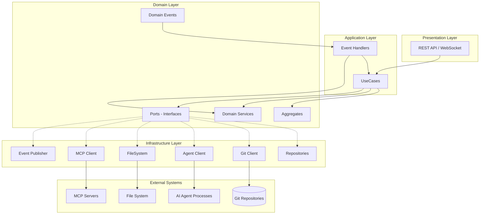
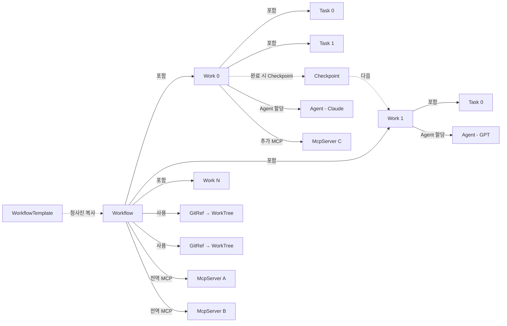

# 서비스 개요

## 1. 시스템 목적

AI Agent 워크플로우 오케스트레이션 엔진. 사전 정의된 워크플로우 템플릿에 따라 AI Agent를 순차적으로 실행하며, 각 Agent는 Git worktree 위에서 코드 작업을 수행한다.

### 핵심 가치
- **템플릿 기반 자동화**: 반복적인 개발 워크플로우를 템플릿으로 정의하고 재사용
- **그래프 순차 실행**: Work → Task 계층 구조로 작업을 분해하고 순차 실행
- **체크포인트/복구**: Work 단위 체크포인트로 중간 실패 시 롤백 및 재개 지원
- **리소스 격리**: Git worktree + WorkSpace symlink로 각 Work의 작업 환경을 격리
- **MCP 도구 확장**: MCP(Model Context Protocol) 서버를 전역/Work 단위로 구성하여 Agent의 도구 접근 범위를 유연하게 제어

---

## 2. 전체 아키텍처



---

## 3. 핵심 실행 모델



**실행 순서**: Workflow 시작 → Work 0의 Agent 시작 (전역 MCP + Work MCP 구성 주입) → Task 순차 실행 (Query 전송 → 응답 → Report 생성) → Work 완료 → Checkpoint 생성 → Work 1 시작 → ... → Workflow 완료

---

## 4. 용어 정의 (Glossary)

| 용어 | 설명 |
|------|------|
| **Git** | 관리 대상 Git 리포지토리. clone된 로컬 경로를 보유 |
| **GitRef** | Git ID + base branch 조합. Workflow가 참조하는 리포지토리 기준점 |
| **WorkflowTemplate** | 재사용 가능한 워크플로우 청사진. Work/Task 구조, Git 참조, MCP 서버 참조를 포함하며 Workflow와 완전히 독립적. 전역 Git/McpServer 삭제 시 참조가 캐스케이딩 제거됨 |
| **Workflow** | Template의 청사진을 깊은 복사하여 생성된 독립 실행 단위. Template에 대한 역참조 없음. 이슈 키, 브랜치 전략 보유 |
| **Work** | Workflow 내 순차 실행 단위. 하나의 AI Agent가 할당됨 |
| **Task** | Work 내 순차 실행 단위. Agent에게 전송할 Query와 선택적 Report 포함 |
| **Report** | Task 실행 결과로 생성되는 마크다운 문서. outline 기반으로 Agent가 작성 |
| **Checkpoint** | Work 완료 시 생성되는 Git 커밋 스냅샷. 롤백 포인트 역할 |
| **WorkTree** | Git worktree. Workflow별로 격리된 작업 디렉토리 |
| **WorkflowSpace** | Workflow 전체의 파일시스템 작업 공간 |
| **WorkSpace** | 개별 Work의 작업 공간. WorkTree와 이전 Report에 대한 symlink 포함 |
| **BranchStrategy** | 작업 브랜치 이름 전략 |
| **AgentModel** | AI Agent 모델 식별자 (예: claude-sonnet-4-20250514, gpt-4) |
| **McpServer** | MCP(Model Context Protocol) 서버 등록 정보. Agent가 사용할 외부 도구 제공 |
| **McpServerRef** | WorkflowTemplate/Workflow/Work에서 McpServer를 참조하는 값 객체. 전역 또는 Work별 구성. Template에서는 청사진 정의에, Workflow/Work에서는 런타임 구성에 사용 |

---

## 5. 시스템 경계

### 내부 (본 시스템이 관리)
- Workflow 생명주기 (생성, 시작, 일시정지, 재개, 취소, 삭제)
- Work/Task 순차 실행 오케스트레이션
- Git worktree 생성/삭제, 브랜치 관리
- 체크포인트 생성 및 롤백
- WorkSpace 구성 (symlink 관리)
- Report 파일 관리
- MCP 서버 등록 및 구성 관리

### 외부 의존성 (Port를 통해 연결)
| 외부 시스템 | Port | 역할 |
|------------|------|------|
| Git | `GitClient` | clone, worktree, branch, commit, reset 등 |
| AI Agent | `AgentClient` | Agent 프로세스 시작/중지, Query 전송 |
| 파일 시스템 | `FileSystem` | 디렉토리/파일/symlink 생성·삭제 |
| MCP 서버 | `McpClient` | MCP 서버 연결 검증, 설정 생성 |
| 이벤트 버스 | `EventPublisher` | 도메인 이벤트 발행 |

---

## 6. 레이어 구조

```
├── Domain Layer (순수 비즈니스 로직, 외부 의존성 없음)
│   ├── Aggregates: Git, McpServer, WorkflowTemplate, Workflow, Work(+Task), Report, Checkpoint, WorkTree, WorkflowSpace(+WorkSpace)
│   ├── Value Objects: 각종 ID, GitUrl, BranchName, CommitHash 등
│   ├── Domain Events: 33+ 이벤트 정의
│   ├── Domain Services: GitLifecycleService, McpLifecycleService, WorkflowResourceService, CheckpointService
│   └── Ports: Repository 인터페이스, Infrastructure 인터페이스
│
├── Application Layer (유스케이스 조율, 트랜잭션 경계)
│   ├── UseCases: Git(2), McpServer(2), WorkflowTemplate(4), Workflow(6), Work(2), Task(2), Modify(4)
│   └── Event Handlers: Work(3), Resource(1), Workflow종료(1), Agent(3), Query(2), Report(2)
│
└── Infrastructure Layer (기술 구현)
    ├── Repository 구현체
    ├── GitClient 구현체
    ├── AgentClient 구현체
    ├── McpClient 구현체
    ├── FileSystem 구현체
    └── EventPublisher 구현체
```

---

## 관련 문서
- [02-도메인-모델.md](02-도메인-모델.md) — Aggregate, Entity, Value Object 상세
- [03-유스케이스.md](03-유스케이스.md) — Application Layer 유스케이스 상세
- [04-이벤트-흐름.md](04-이벤트-흐름.md) — 이벤트 기반 실행 흐름
- [05-인프라스트럭처.md](05-인프라스트럭처.md) — Port/Adapter 및 리소스 관리
- [06-API-설계.md](06-API-설계.md) — REST API 엔드포인트 및 WebSocket 프로토콜
- [07-에러처리-및-복원력.md](07-에러처리-및-복원력.md) — 에러 분류, 재시도, 타임아웃, Circuit Breaker
- [08-동시성-및-트랜잭션.md](08-동시성-및-트랜잭션.md) — 동시성 제어, 트랜잭션 경계, Saga 패턴
- [09-인증-및-보안.md](09-인증-및-보안.md) — 인증, 인가, 데이터 보호, 보안 전략
- [10-운영-및-모니터링.md](10-운영-및-모니터링.md) — 로깅, 메트릭, 트레이싱, 배포 전략
- [11-검증-및-테스트.md](11-검증-및-테스트.md) — 입력 검증, 테스트 전략
- [06-UI-설계방향.md](../06-UI-설계방향.md) — UI 설계 방향 및 인터랙션 모델
