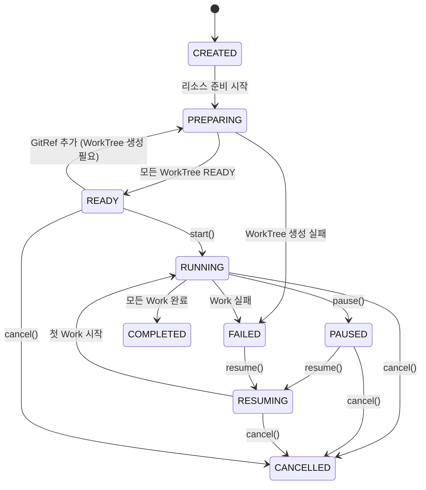
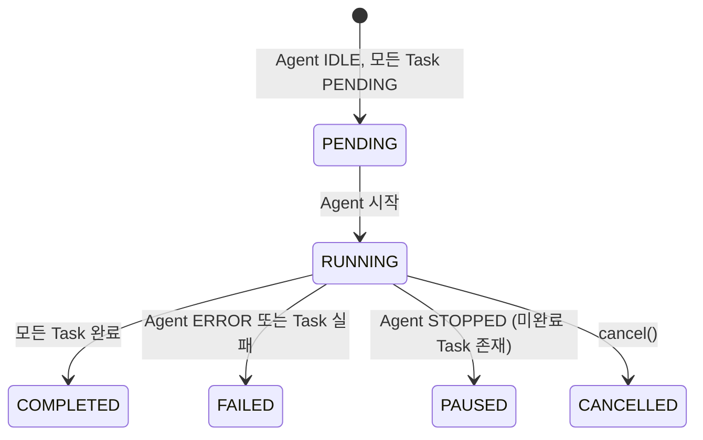
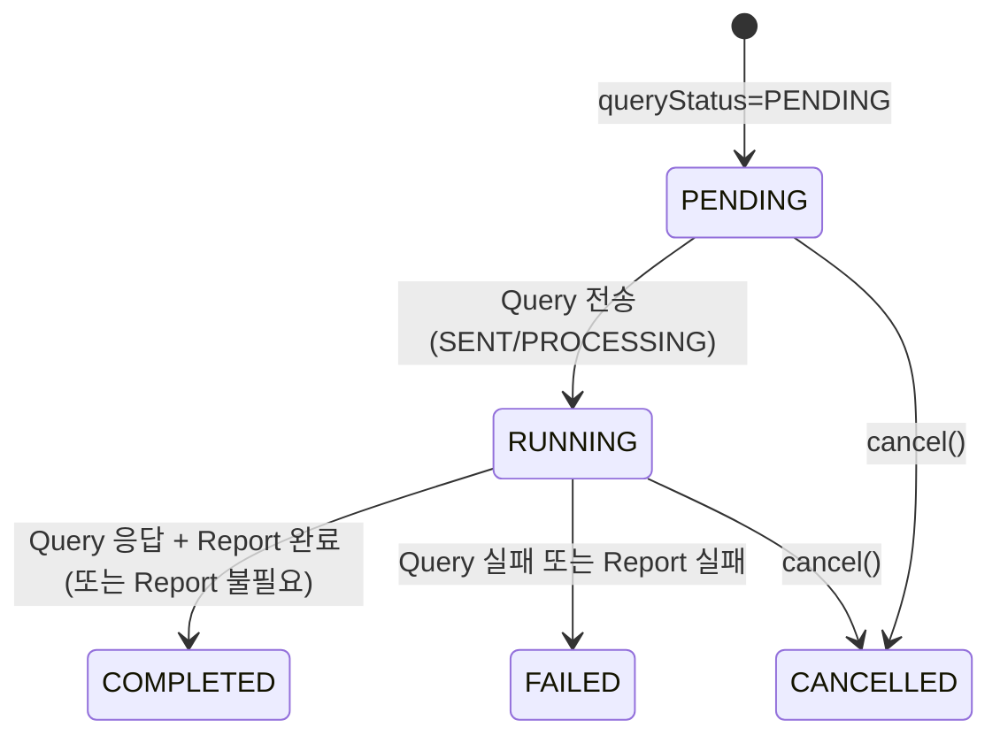

# 도메인 모델

## 1. Aggregate 관계도

```mermaid
erDiagram
    Git ||--o{ WorkTree : "worktree 생성"
    Git ||--o{ Workflow : "activeWorkflowIds"

    McpServer ||--o{ Workflow : "mcpServerRefs (전역)"
    McpServer ||--o{ Work : "mcpServerRefs (Work별)"

    Git ||--o{ WorkflowTemplate : "gitRefs (캐스케이딩 삭제)"
    McpServer ||--o{ WorkflowTemplate : "mcpServerRefs (캐스케이딩 삭제)"

    WorkflowTemplate ..o{ Workflow : "청사진 복사 (독립적, 참조 없음)"
    WorkflowTemplate ||--|{ WorkDefinition : "포함"
    WorkDefinition ||--|{ TaskDefinition : "포함"

    Workflow ||--|{ Work : "workIds"
    Workflow }|--|{ GitRef : "참조"
    Workflow }|--o{ McpServerRef : "전역 MCP 참조"
    Workflow ||--o{ WorkTree : "workflowId"
    Workflow ||--|| WorkflowSpace : "workflowId"
    Workflow ||--o{ Checkpoint : "workflowId"

    Work ||--|{ Task : "포함 (내부 엔티티)"
    Work }|--o{ GitRef : "Work별 Git 참조"
    Work }|--o{ McpServerRef : "Work별 MCP 참조"
    Work ||--o{ Checkpoint : "workId"

    Task ||--o| Report : "reportId (선택)"

    WorkflowSpace ||--|{ WorkSpace : "포함 (내부 엔티티)"
    WorkSpace ||--o{ SymLink : "포함"
```

---

## 2. Aggregate 상세

### 2.1 Git Aggregate

Git 리포지토리의 로컬 클론을 관리한다. 여러 Workflow가 동시에 사용할 수 있으며, 사용 중이면 삭제할 수 없다.

| 필드 | 타입 | 설명 |
|------|------|------|
| `id` | `GitId` | 고유 식별자 |
| `url` | `GitUrl` | 원격 리포지토리 URL |
| `localPath` | `string` | 로컬 클론 경로 |
| `activeWorkflowIds` | `Set<WorkflowId>` | 현재 사용 중인 Workflow 목록 |

**불변식**
- `activeWorkflowIds`가 비어있어야만 삭제 가능

**Command**
- `addWorkflow(workflowId)` — 사용 등록
- `removeWorkflow(workflowId)` — 사용 해제

---

### 2.2 McpServer Aggregate

MCP(Model Context Protocol) 서버 등록 정보를 관리한다. Git과 동일한 패턴으로, 전역 리소스로 등록되고 Workflow/Work에서 참조한다.

| 필드 | 타입 | 설명 |
|------|------|------|
| `id` | `McpServerId` | 고유 식별자 |
| `name` | `string` | 서버 표시 이름 |
| `command` | `string` | 실행 명령어 (예: `npx`, `uvx`, `docker run`) |
| `args` | `String[]` | 명령어 인자 |
| `env` | `Map<String, String>` | 환경 변수 |
| `transportType` | `McpTransportType` | 전송 방식 (STDIO, SSE, STREAMABLE_HTTP) |
| `url` | `string \| null` | SSE/HTTP 방식일 때 서버 URL |
| `activeWorkflowIds` | `Set<WorkflowId>` | 현재 사용 중인 Workflow 목록 |

**불변식**
- `activeWorkflowIds`가 비어있어야만 삭제 가능 (Git과 동일 패턴)

**Command**
- `addWorkflow(workflowId)` — 사용 등록
- `removeWorkflow(workflowId)` — 사용 해제

**Git과의 대칭 구조**
```
Git       : 전역 등록 → GitRef로 Workflow/Work 양쪽에서 참조 → WorkTree로 물리 인스턴스화 → WorkSpace에서 symlink 접근
McpServer : 전역 등록 → McpServerRef로 Workflow/Work 양쪽에서 참조 → Agent 시작 시 설정 병합 주입
```
두 리소스 모두 Workflow 레벨(전역)과 Work 레벨(개별)에서 참조 가능하며, Work 시작 시 병합된다. 차이점은 Git은 물리적 인스턴스(WorkTree)가 필요하고, MCP는 설정 병합만으로 처리된다는 점이다.

---

### 2.3 WorkflowTemplate Aggregate

Workflow를 생성하기 위한 재사용 가능한 청사진. **Workflow와 완전히 독립적**이며, 인스턴스화 이후 Template과 Workflow 사이에는 어떠한 런타임 관계도 없다. 기존 Workflow로부터 역으로 Template을 생성할 수도 있다.

| 필드 | 타입 | 설명 |
|------|------|------|
| `id` | `WorkflowTemplateId` | 고유 식별자 |
| `name` | `string` | 템플릿 이름 |
| `description` | `string` | 설명 |
| `workDefinitions` | `WorkDefinition[]` | Work 정의 목록 (순서 포함) |
| `gitRefs` | `GitRef[]` | 참조할 Git 리포지토리 + base branch |
| `mcpServerRefs` | `McpServerRef[]` | 전역 MCP 서버 참조 (모든 Work에 적용) |

**독립성 원칙**
- Template은 Workflow의 청사진일 뿐이며, 인스턴스화 시 모든 값이 **깊은 복사(deep copy)** 된다
- Workflow 생성 후 Template을 수정해도 기존 Workflow에 영향 없음
- Workflow 생성 후 Template을 삭제해도 기존 Workflow에 영향 없음
- 기존 Workflow의 구조를 추출하여 새 Template을 생성할 수 있음

**캐스케이딩 규칙 (전역 리소스 삭제 시)**
- 전역 Git이 삭제되면 → 해당 `gitId`를 참조하는 모든 Template의 `gitRefs`에서 해당 항목 자동 제거
- 전역 McpServer가 삭제되면 → 해당 `mcpServerId`를 참조하는 모든 Template의 `mcpServerRefs`에서 해당 항목 자동 제거
- WorkDefinition 내부의 `mcpServerRefs`에서도 동일하게 제거
- 캐스케이딩 제거 후 Template의 `gitRefs`가 비어도 Template 자체는 유지 (재편집 가능)

**Command**
- `updateGitRefs(newGitRefs)` — Git 참조 목록 변경
- `updateMcpServerRefs(newMcpServerRefs)` — 전역 MCP 참조 변경
- `removeGitRef(gitId)` — 특정 Git 참조 캐스케이딩 제거
- `removeMcpServerRef(mcpServerId)` — 특정 MCP 참조 캐스케이딩 제거 (전역 + WorkDefinition 내부)
- `addWorkDefinition(workDefinition)` — Work 정의 추가
- `removeWorkDefinition(order)` — Work 정의 제거
- `updateWorkDefinition(order, workDefinition)` — Work 정의 수정

**WorkDefinition** (값 객체)

| 필드 | 타입 | 설명 |
|------|------|------|
| `order` | `number` | 실행 순서 |
| `model` | `AgentModel` | 사용할 AI 모델 |
| `gitRefs` | `GitRef[]` | Work별 추가 Git 참조 |
| `mcpServerRefs` | `McpServerRef[]` | Work별 추가 MCP 서버 참조 |
| `taskDefinitions` | `TaskDefinition[]` | Task 정의 목록 |

**TaskDefinition** (값 객체)

| 필드 | 타입 | 설명 |
|------|------|------|
| `order` | `number` | 실행 순서 |
| `query` | `string` | Agent에게 전송할 프롬프트 |
| `reportOutline` | `ReportOutline | null` | Report 생성 시 사용할 아웃라인 |

---

### 2.4 Workflow Aggregate

Template의 청사진을 깊은 복사하여 생성된 독립 실행 단위. Template에 대한 역참조를 보유하지 않는다. 하위 Work들의 실행 순서와 상태를 관리하며, WorkTree 리소스 상태도 추적한다.

| 필드 | 타입 | 설명 |
|------|------|------|
| `id` | `WorkflowId` | 고유 식별자 |
| `issueKey` | `IssueKey` | 연결된 이슈 키 |
| `branchStrategy` | `BranchStrategy` | 작업 브랜치 전략 |
| `gitRefs` | `GitRef[]` | 참조 Git 목록 |
| `mcpServerRefs` | `McpServerRef[]` | 전역 MCP 서버 참조 |
| `workIds` | `WorkId[]` | 하위 Work ID 목록 |
| `workSequences` | `Map<WorkId, Int>` | Work별 실행 순서 |
| `workTreeStatuses` | `Map<GitId, WorkTreeTrackingInfo>` | GitId별 WorkTree 상태 추적 |
| `workStatuses` | `Map<WorkId, WorkStatus>` | Work 상태 추적 |
| `status` | `WorkflowStatus` | 명시적 상태 |

**파생 상태** (`computedStatus()`)

Workflow의 실제 상태는 하위 리소스/Work 상태에서 파생된다:



**불변식**
- `start()`: `computedStatus() == READY`일 때만 가능
- `pause()`: `RUNNING` 상태에서만 가능
- `resume()`: `PAUSED` 또는 `FAILED` 상태에서만 가능
- `cancel()`: `READY`, `RUNNING`, `PAUSED`, `RESUMING` 상태에서 가능
- `delete()`: `CREATED`, `COMPLETED`, `FAILED`, `CANCELLED` 상태에서 가능
- `modify()`: `CREATED`, `READY`, `PAUSED`, `FAILED` 상태에서 가능

---

### 2.5 Work Aggregate (Task 포함)

Workflow 내 순차 실행 단위. 하나의 AI Agent가 할당되며, 내부에 Task 목록을 포함한다.

| 필드 | 타입 | 설명 |
|------|------|------|
| `id` | `WorkId` | 고유 식별자 |
| `workflowId` | `WorkflowId` | 소속 Workflow |
| `sequence` | `number` | 실행 순서 |
| `model` | `AgentModel` | 할당 AI 모델 |
| `gitRefs` | `GitRef[]` | Work별 추가 Git 참조 |
| `mcpServerRefs` | `McpServerRef[]` | Work별 추가 MCP 서버 참조 |
| `agentStatus` | `AgentStatus` | Agent 프로세스 상태 |
| `tasks` | `Task[]` | Task 목록 (내부 엔티티) |
| `currentTaskIndex` | `number` | 현재 실행 중인 Task 인덱스 |

**파생 상태** (`computedStatus()`)



**Task** (Work 내부 엔티티)

| 필드 | 타입 | 설명 |
|------|------|------|
| `id` | `TaskId` | 고유 식별자 |
| `order` | `number` | 실행 순서 |
| `query` | `string` | Agent에게 전송할 프롬프트 |
| `reportId` | `ReportId | null` | 연결된 Report (선택) |
| `queryStatus` | `QueryStatus` | 쿼리 처리 상태 |
| `reportStatus` | `ReportGenerationStatus` | Report 생성 상태 |

**Task 파생 상태** (`computedStatus()`)



---

### 2.6 Report Aggregate

Task 실행 결과로 생성되는 마크다운 문서. outline에 따라 Agent가 내용을 작성한다.

| 필드 | 타입 | 설명 |
|------|------|------|
| `id` | `ReportId` | 고유 식별자 |
| `taskId` | `TaskId` | 연결된 Task |
| `workflowId` | `WorkflowId` | 소속 Workflow |
| `outline` | `ReportOutline` | 섹션 구조 정의 |
| `filePath` | `string | null` | 생성된 파일 경로 |
| `status` | `ReportStatus` | PENDING → GENERATING → COMPLETED / FAILED |

---

### 2.7 Checkpoint Aggregate

Work 완료 시 생성되는 Git 커밋 스냅샷. Resume 시 롤백 포인트로 사용된다.

| 필드 | 타입 | 설명 |
|------|------|------|
| `id` | `CheckpointId` | 고유 식별자 |
| `workflowId` | `WorkflowId` | 소속 Workflow |
| `workId` | `WorkId` | 완료된 Work |
| `workSequence` | `number` | 생성 시점의 Work 순서 |
| `commitHashes` | `Map<GitId, CommitHash>` | Git별 커밋 해시 |
| `createdAt` | `Date` | 생성 시각 |

**유효성 판정 메커니즘**: Checkpoint는 생성 시점의 `workSequence`를 기록한다. Resume 시 `CheckpointRepository.findValidCheckpoints(workflowId)` 조회에서, 각 Checkpoint의 `workSequence`가 현재 Workflow의 Work 순서와 일치하는지 **조회 시점에 필터링**하여 유효한 Checkpoint만 반환한다. Work reorder/추가/삭제로 순서가 변경되면 기존 Checkpoint의 `workSequence`가 현재 순서와 불일치하여 자동으로 무효 판정된다. 무효화된 Checkpoint는 데이터에서 삭제되지 않으며, 이력 보존 목적으로 유지된다.

---

### 2.8 WorkTree Aggregate

**GitRef에 종속적인** Git worktree 물리 인스턴스. Workflow별로 각 GitRef에 대해 하나의 WorkTree를 생성하며, **WorkflowSpace 내에 물리적으로 존재**한다. Work는 WorkSpace에서 symlink를 통해 WorkTree에 접근한다.

| 필드 | 타입 | 설명 |
|------|------|------|
| `id` | `WorkTreeId` | 고유 식별자 |
| `gitId` | `GitId` | 소속 Git (GitRef를 통해 종속) |
| `workflowId` | `WorkflowId` | 소속 Workflow |
| `path` | `string` | worktree 경로 (WorkflowSpace 내) |
| `branch` | `BranchName` | 작업 브랜치 |
| `status` | `WorkTreeStatus` | PENDING → CREATING → READY / FAILED → PENDING_RELEASE → RELEASED |

**GitRef 종속 관계**
```
Git (전역 리소스)
 └→ GitRef (참조 값 객체: gitId + baseBranch)
      └→ WorkTree (물리 인스턴스: git worktree 디렉토리)
```

- WorkTree는 GitRef가 존재해야만 의미가 있다
- GitRef가 제거되면 WorkTree도 삭제 대상이 된다
- WorkTree는 WorkflowSpace 내에 생성되며, WorkSpace에서는 symlink로만 접근한다

**삭제 정책 (GitRef 제거 시)**

| Workflow 상태 | WorkTree 삭제 방식 | 이유 |
|--------------|------------------|------|
| RUNNING | **삭제 예약** (PENDING_RELEASE) | Agent가 symlink를 통해 WorkTree를 사용 중일 수 있음. Workflow 종료 시 실제 삭제 |
| 그 외 (CREATED, READY, PAUSED, FAILED 등) | **즉시 삭제** (RELEASED) | Agent가 동작 중이 아니므로 안전하게 삭제 가능 |

**불변식**
- 동일 Workflow 내에서 동일 GitId에 대한 WorkTree는 최대 하나
- PENDING_RELEASE 상태의 WorkTree는 새로운 symlink 생성 대상에서 제외

---

### 2.9 WorkflowSpace Aggregate (WorkSpace 포함)

Workflow의 파일시스템 작업 공간. 하위에 Work별 WorkSpace를 포함한다.

| 필드 | 타입 | 설명 |
|------|------|------|
| `id` | `WorkflowSpaceId` | 고유 식별자 |
| `workflowId` | `WorkflowId` | 소속 Workflow |
| `path` | `string` | 루트 디렉토리 |
| `workSpaces` | `WorkSpace[]` | Work별 작업 공간 |
| `status` | `ResourceStatus` | PENDING → CREATED → ACTIVE → RELEASED |

**WorkSpace** (내부 엔티티)

| 필드 | 타입 | 설명 |
|------|------|------|
| `id` | `WorkSpaceId` | 고유 식별자 |
| `workId` | `WorkId` | 연결된 Work |
| `path` | `string` | 작업 디렉토리 |
| `links` | `SymLink[]` | symlink 목록 (WorkTree, Report) |
| `status` | `ResourceStatus` | 리소스 상태 |

**SymLink** (값 객체)

| 필드 | 타입 | 설명 |
|------|------|------|
| `type` | `LinkType` | WORKTREE 또는 REPORT |
| `targetId` | `string` | 대상 ID |
| `targetPath` | `string` | 실제 경로 |
| `linkPath` | `string` | symlink 경로 |

---

## 3. Value Objects

### ID 타입
| 이름 | 설명 |
|------|------|
| `GitId` | Git 리포지토리 식별자 |
| `WorkflowTemplateId` | 워크플로우 템플릿 식별자 |
| `WorkflowId` | 워크플로우 인스턴스 식별자 |
| `WorkId` | Work 식별자 |
| `TaskId` | Task 식별자 |
| `ReportId` | Report 식별자 |
| `WorkTreeId` | WorkTree 식별자 |
| `WorkflowSpaceId` | WorkflowSpace 식별자 |
| `WorkSpaceId` | WorkSpace 식별자 |
| `CheckpointId` | Checkpoint 식별자 |
| `McpServerId` | MCP 서버 식별자 |

### 도메인 값 타입
| 이름 | 설명 |
|------|------|
| `GitUrl` | Git 원격 URL |
| `BranchName` | 브랜치 이름 |
| `CommitHash` | Git 커밋 해시 |
| `IssueKey` | 이슈 트래커 키 |
| `AgentModel` | AI 모델 식별자 |

### 복합 값 객체
| 이름 | 구성 | 설명 |
|------|------|------|
| `GitRef` | gitId + baseBranch | Git 리포지토리 참조 기준점 |
| `BranchStrategy` | workBranch | 작업 브랜치 전략 |
| `ReportOutline` | sections: Section[] | Report 섹션 구조 |
| `Section` | title + description | Report 개별 섹션 |
| `McpServerRef` | mcpServerId + envOverrides | MCP 서버 참조 (환경변수 오버라이드 가능) |
| `WorkTreeTrackingInfo` | workTreeId? + status | Workflow 내 GitId별 WorkTree 추적 정보. CREATED 상태에서는 workTreeId가 null |

---

## 4. Enum 정의

### WorkflowStatus
`CREATED` → `PREPARING` → `READY` → `RUNNING` → `COMPLETED`
분기: `PAUSED`, `RESUMING`, `FAILED`, `CANCELLED`

### WorkStatus
`PENDING` → `RUNNING` → `COMPLETED`
분기: `PAUSED`, `FAILED`, `CANCELLED`

### AgentStatus
`IDLE` → `STARTING` → `RUNNING` → `STOPPED`
분기: `ERROR`

### TaskStatus (파생)
`PENDING` → `RUNNING` → `COMPLETED`
분기: `FAILED`, `CANCELLED`

### QueryStatus
`PENDING` → `SENT` → `PROCESSING` → `RESPONDED`
분기: `FAILED`, `CANCELLED`

### ReportGenerationStatus
`NOT_REQUIRED` | `PENDING` → `GENERATING` → `COMPLETED`
분기: `FAILED`, `CANCELLED`

### ReportStatus
`PENDING` → `GENERATING` → `COMPLETED`
분기: `FAILED`

### WorkTreeStatus
`PENDING` → `CREATING` → `READY`
분기: `FAILED` → `RELEASED`
`READY` → `PENDING_RELEASE` → `RELEASED` (런타임 중 GitRef 제거 시 삭제 예약)

### ResourceStatus
`PENDING` → `CREATED` → `ACTIVE` → `RELEASED`

### McpTransportType
`STDIO` | `SSE` | `STREAMABLE_HTTP`

---

## 5. Aggregate 경계 정리

| Aggregate Root | 내부 엔티티 | 트랜잭션 경계 |
|---------------|------------|-------------|
| Git | — | 단독 |
| McpServer | — | 단독 |
| WorkflowTemplate | WorkDefinition, TaskDefinition | 단독 (전역 리소스 삭제 시 캐스케이딩 대상) |
| Workflow | — | 단독 (Work 상태는 Map으로 추적) |
| Work | Task | Work + Task 함께 저장 |
| Report | — | 단독 |
| Checkpoint | — | 단독 |
| WorkTree | — | 단독 |
| WorkflowSpace | WorkSpace, SymLink | WorkflowSpace + WorkSpace 함께 저장 |

---

## 관련 문서
- [01-서비스-개요.md](01-서비스-개요.md) — 시스템 전체 개요
- [03-유스케이스.md](03-유스케이스.md) — Aggregate를 조작하는 유스케이스
- [04-이벤트-흐름.md](04-이벤트-흐름.md) — 상태 변경에 따른 이벤트 흐름
- [08-동시성-및-트랜잭션.md](08-동시성-및-트랜잭션.md) — Aggregate별 동시성 제어 및 트랜잭션 경계
- [11-검증-및-테스트.md](11-검증-및-테스트.md) — Value Object 검증 규칙 및 불변식 테스트
