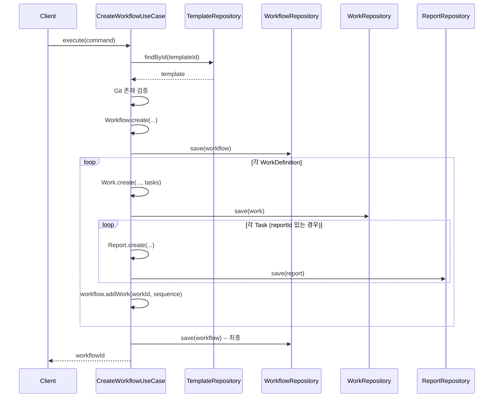
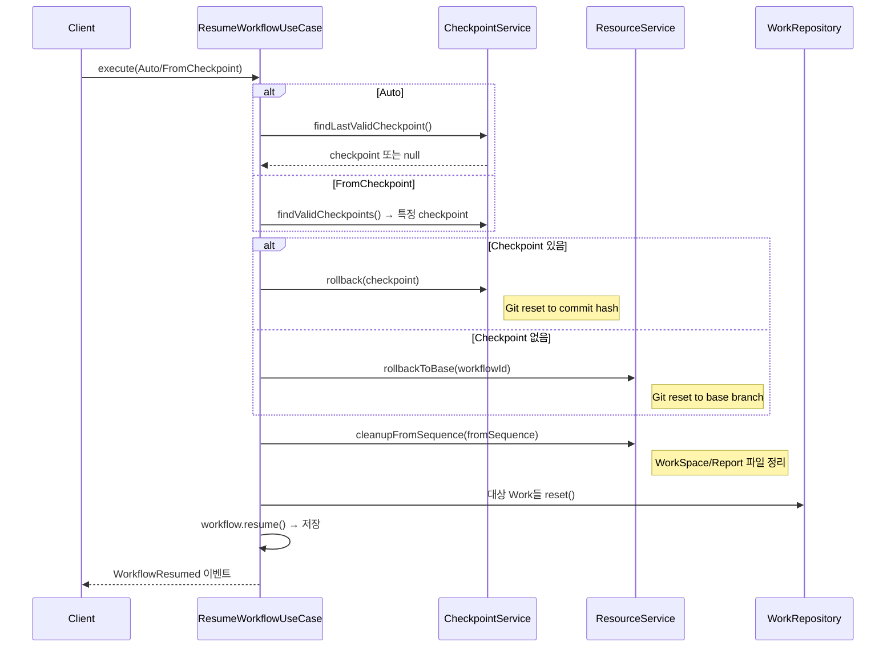

# 유스케이스

## 1. 유스케이스 분류

| 분류 | 유스케이스 | 설명 |
|------|----------|------|
| **Git** | CreateGitUseCase | Git 리포지토리 등록 (clone) |
| | DeleteGitUseCase | Git 리포지토리 삭제 |
| **McpServer** | RegisterMcpServerUseCase | MCP 서버 등록 |
| | UnregisterMcpServerUseCase | MCP 서버 삭제 |
| **WorkflowTemplate** | CreateWorkflowTemplateUseCase | 워크플로우 템플릿 생성 |
| | CreateTemplateFromWorkflowUseCase | 기존 Workflow 구조에서 템플릿 생성 |
| | UpdateWorkflowTemplateUseCase | 워크플로우 템플릿 수정 |
| | DeleteWorkflowTemplateUseCase | 워크플로우 템플릿 삭제 |
| **Workflow** | CreateWorkflowUseCase | 템플릿에서 Workflow 인스턴스 생성 |
| | StartWorkflowUseCase | Workflow 실행 시작 |
| | PauseWorkflowUseCase | 실행 중 일시정지 |
| | ResumeWorkflowUseCase | 일시정지/실패에서 재개 |
| | CancelWorkflowUseCase | 실행 취소 |
| | DeleteWorkflowUseCase | Workflow 및 관련 리소스 삭제 |
| **Work** | StartNextWorkUseCase | 다음 순서 Work 실행 |
| | ReorderWorksUseCase | Work 실행 순서 변경 |
| **Task** | SendQueryUseCase | 현재 Task의 Query를 Agent에게 전송 |
| | CompleteTaskUseCase | Task 완료 처리 및 다음 진행 |
| **Modify** | ModifyWorkflowUseCase | Workflow 구조 수정 (Task CRUD, GitRef/McpServerRef 변경) |

---

## 2. Git 유스케이스

### 2.1 CreateGitUseCase

Git 리포지토리를 clone하고 시스템에 등록한다.

| 항목 | 내용 |
|------|------|
| **Command** | `CreateGitCommand(url: GitUrl, localPath: Path)` |
| **선행조건** | 없음 |
| **발행 이벤트** | `GitCreated` |

**실행 단계**
1. `GitClient.clone(url, localPath)`
2. `Git.create(url, localPath)`
3. `GitRepository.save(git)`
4. `GitCreated` 이벤트 발행

### 2.2 DeleteGitUseCase

Git 리포지토리를 시스템에서 제거한다.

| 항목 | 내용 |
|------|------|
| **입력** | `GitId` |
| **선행조건** | `git.canDelete() == true` (사용 중인 Workflow 없음) |
| **발행 이벤트** | `GitDeleted` |

**실행 단계**
1. Git 조회 및 삭제 가능 여부 확인
2. `GitClient.deleteRepo(localPath)`
3. `GitRepository.delete(git)`
4. 모든 WorkflowTemplate에서 해당 gitId를 참조하는 gitRefs 캐스케이딩 제거
   - `WorkflowTemplateRepository.findByGitId(gitId)` → 각 template에 `template.removeGitRef(gitId)` → 저장
5. `GitDeleted` 이벤트 발행

---

## 3. McpServer 유스케이스

### 3.1 RegisterMcpServerUseCase

MCP 서버를 시스템에 등록한다. 연결 검증 후 저장한다.

| 항목 | 내용 |
|------|------|
| **Command** | `RegisterMcpServerCommand(name, command, args, env, transportType, url?)` |
| **선행조건** | 없음 |
| **발행 이벤트** | `McpServerRegistered` |

**실행 단계**
1. `McpClient.validate(command, args, transportType, url)` — 연결 가능 여부 검증
2. `McpServer.create(...)`
3. `McpServerRepository.save(mcpServer)`
4. `McpServerRegistered` 이벤트 발행

### 3.2 UnregisterMcpServerUseCase

MCP 서버를 시스템에서 제거한다.

| 항목 | 내용 |
|------|------|
| **입력** | `McpServerId` |
| **선행조건** | `mcpServer.canDelete() == true` (사용 중인 Workflow 없음) |
| **발행 이벤트** | `McpServerUnregistered` |

**실행 단계**
1. McpServer 조회 및 삭제 가능 여부 확인
2. `McpServerRepository.delete(mcpServer)`
3. 모든 WorkflowTemplate에서 해당 mcpServerId를 참조하는 mcpServerRefs 캐스케이딩 제거 (전역 + WorkDefinition 내부 모두)
   - `WorkflowTemplateRepository.findByMcpServerId(mcpServerId)` → 각 template에 `template.removeMcpServerRef(mcpServerId)` → 저장
4. `McpServerUnregistered` 이벤트 발행

---

## 3-1. WorkflowTemplate 유스케이스

### 3-1.1 CreateWorkflowTemplateUseCase

새 워크플로우 템플릿을 생성한다.

| 항목 | 내용 |
|------|------|
| **Command** | `CreateWorkflowTemplateCommand(name, description, workDefinitions, gitRefs, mcpServerRefs)` |
| **검증** | 참조된 모든 gitId가 GitRepository에 존재, 참조된 모든 mcpServerId가 McpServerRepository에 존재 |
| **발행 이벤트** | `WorkflowTemplateCreated` |

**실행 단계**
1. gitRefs의 모든 gitId 존재 검증
2. mcpServerRefs 및 workDefinitions 내 mcpServerRefs의 모든 mcpServerId 존재 검증
3. `WorkflowTemplate.create(...)`
4. `WorkflowTemplateRepository.save(template)`
5. `WorkflowTemplateCreated` 이벤트 발행

### 3-1.2 CreateTemplateFromWorkflowUseCase

기존 Workflow의 구조를 추출하여 새 WorkflowTemplate을 생성한다. 런타임 상태(실행 상태, issueKey, branchStrategy 등)는 제거하고 구조(Work/Task 정의, GitRef, McpServerRef)만 복사한다.

| 항목 | 내용 |
|------|------|
| **Command** | `CreateTemplateFromWorkflowCommand(workflowId, templateName, templateDescription)` |
| **선행조건** | Workflow 존재 |
| **발행 이벤트** | `WorkflowTemplateCreated` |

**실행 단계**
1. Workflow 조회
2. Workflow의 workIds로 모든 Work 조회
3. 각 Work에서 WorkDefinition 추출:
   - `work.model` → `workDefinition.model`
   - `work.gitRefs` → `workDefinition.gitRefs`
   - `work.mcpServerRefs` → `workDefinition.mcpServerRefs`
   - `work.tasks` → `workDefinition.taskDefinitions` (각 Task에서 query, reportOutline 추출)
   - `work.sequence` → `workDefinition.order`
4. Workflow의 `gitRefs`, `mcpServerRefs` 복사
5. `WorkflowTemplate.create(name, description, workDefinitions, gitRefs, mcpServerRefs)`
6. `WorkflowTemplateRepository.save(template)`
7. `WorkflowTemplateCreated` 이벤트 발행

### 3-1.3 UpdateWorkflowTemplateUseCase

워크플로우 템플릿의 구조를 수정한다. Template은 Workflow와 독립적이므로 언제든 수정 가능하며, 이미 생성된 Workflow에는 영향이 없다.

| 항목 | 내용 |
|------|------|
| **Command** | `UpdateWorkflowTemplateCommand(templateId, name?, description?, workDefinitions?, gitRefs?, mcpServerRefs?)` |
| **검증** | 변경된 gitRefs/mcpServerRefs의 존재 검증 |
| **발행 이벤트** | `WorkflowTemplateUpdated` |

### 3-1.4 DeleteWorkflowTemplateUseCase

워크플로우 템플릿을 삭제한다. Template은 Workflow와 완전히 독립적이므로 언제든 삭제 가능하며, 이 Template으로 생성된 기존 Workflow에는 어떠한 영향도 없다. (Workflow는 Template에 대한 참조를 보유하지 않음)

| 항목 | 내용 |
|------|------|
| **입력** | `WorkflowTemplateId` |
| **선행조건** | 없음 (언제든 삭제 가능) |
| **발행 이벤트** | `WorkflowTemplateDeleted` |

**실행 단계**
1. Template 조회
2. `WorkflowTemplateRepository.delete(template)`
3. `WorkflowTemplateDeleted` 이벤트 발행

---

## 4. Workflow 유스케이스

### 4.1 CreateWorkflowUseCase

템플릿에서 Workflow 인스턴스를 생성하고, Work/Task/Report를 함께 생성한다.

| 항목 | 내용 |
|------|------|
| **Command** | `CreateWorkflowCommand(templateId, issueKey, workBranch)` — templateId는 조회용으로만 사용되며 Workflow에 저장되지 않음 |
| **선행조건** | Template 존재, 참조 Git 존재 |
| **발행 이벤트** | `WorkflowCreated` |

### 4.2 StartWorkflowUseCase

Workflow 실행을 시작한다. Git 사용 등록, 리소스 준비 후 첫 Work를 실행한다.

| 항목 | 내용 |
|------|------|
| **입력** | `WorkflowId` |
| **선행조건** | `workflow.canStart() == true` (READY 상태) |
| **발행 이벤트** | `WorkflowStarted` |

**실행 단계**
1. Git 사용 등록 (`GitLifecycleService.registerUsage`)
2. MCP 서버 사용 등록 (`McpLifecycleService.registerUsage`)
3. 리소스 준비 (`WorkflowResourceService.prepareResources`)
   - WorkflowSpace 생성
   - Git별 WorkTree 생성 (branch + worktree)
4. `workflow.start()` → 저장
5. `WorkflowStarted` 이벤트 발행 → `StartNextWorkUseCase` 트리거

### 4.3 PauseWorkflowUseCase

실행 중인 Workflow를 일시정지한다.

| 항목 | 내용 |
|------|------|
| **입력** | `WorkflowId` |
| **선행조건** | `workflow.canPause() == true` (RUNNING 상태) |
| **발행 이벤트** | `WorkflowPaused` |

**실행 단계**
1. 실행 중인 Work 조회
2. 각 Work에 대해: `AgentClient.stop()` + `work.pause()`
3. `workflow.pause()` → 저장

### 4.4 ResumeWorkflowUseCase

일시정지/실패 상태에서 Workflow를 재개한다.

| 항목 | 내용 |
|------|------|
| **Command** | `ResumeWorkflowCommand.Auto(workflowId)` 또는 `FromCheckpoint(workflowId, checkpointId)` |
| **선행조건** | `workflow.canResume() == true` (PAUSED 또는 FAILED) |
| **발행 이벤트** | `WorkflowResumed` |

**Resume 전략**
- **Auto**: 마지막 유효 Checkpoint 다음 Work부터 재개. 없으면 처음부터
- **FromCheckpoint**: 지정 Checkpoint 다음 Work부터 재개

### 4.5 CancelWorkflowUseCase

Workflow 실행을 취소한다.

| 항목 | 내용 |
|------|------|
| **입력** | `WorkflowId` |
| **선행조건** | `workflow.canCancel() == true` |
| **발행 이벤트** | `WorkflowCancelled` |

**실행 단계**
1. 실행/일시정지 중인 Work 조회
2. 각 Work: `AgentClient.stop()` + `work.cancel()`
3. `workflow.cancel()` → 저장

### 4.6 DeleteWorkflowUseCase

Workflow와 모든 관련 리소스를 삭제한다.

| 항목 | 내용 |
|------|------|
| **입력** | `WorkflowId` |
| **선행조건** | `workflow.canDelete() == true` (CREATED/COMPLETED/FAILED/CANCELLED) |

**실행 단계**
1. 리소스 정리 (WorkTree 삭제, 브랜치 삭제, WorkflowSpace 삭제)
2. Git 사용 해제
3. 하위 엔티티 삭제 (Checkpoint, Report, Work)
4. Workflow 삭제

---

## 5. Work 유스케이스

### 5.1 StartNextWorkUseCase

다음 순서의 PENDING Work를 찾아 실행한다.

| 항목 | 내용 |
|------|------|
| **입력** | `WorkflowId` |
| **선행조건** | Workflow가 RUNNING 또는 RESUMING 상태 |
| **발행 이벤트** | `WorkStarted` (또는 `WorkflowCompleted` — 모든 Work 완료 시) |

**실행 단계**
1. Workflow 상태 확인 (RUNNING/RESUMING)
2. PENDING 상태인 첫 Work 조회
3. 없으면: 모든 Work 완료 확인 → `WorkflowCompleted` 발행
4. 있으면:
   - RESUMING → RUNNING 전이
   - GitRef 병합: Workflow 전역 `gitRefs` + Work별 `gitRefs` → 병합된 GitRef 목록으로 WorkSpace symlink 대상 결정
   - `WorkflowResourceService.prepareWorkSpace()` — 병합된 GitRef 기준으로 symlink 구성
   - MCP 설정 병합: Workflow 전역 `mcpServerRefs` + Work별 `mcpServerRefs`
   - `AgentClient.start(workId, model, mergedMcpConfig)`
   - `WorkStarted` 이벤트 발행

### 5.2 ReorderWorksUseCase

Work의 실행 순서를 변경한다.

| 항목 | 내용 |
|------|------|
| **입력** | `WorkflowId`, `newOrder: WorkId[]` |
| **선행조건** | `workflow.canModify() == true` (CREATED/READY/PAUSED/FAILED) |

**실행 단계**
1. Workflow의 workSequences 업데이트
2. 각 Work의 sequence 업데이트
3. 기존 Checkpoint는 workSequence 불일치로 자동 무효화

---

## 6. Task 유스케이스

### 6.1 SendQueryUseCase

현재 Task의 Query를 Agent에게 전송한다.

| 항목 | 내용 |
|------|------|
| **입력** | `WorkId` |
| **발행 이벤트** | `QuerySent`, `TaskStarted` |

**실행 단계**
1. Work의 `currentTask()` 조회
2. Report outline 조회 (있는 경우)
3. `AgentClient.sendQuery(workId, query, reportOutline)`
4. queryStatus → SENT

### 6.2 CompleteTaskUseCase

Task를 완료 처리하고 다음 Task로 진행한다.

| 항목 | 내용 |
|------|------|
| **입력** | `WorkId`, `TaskId` |
| **발행 이벤트** | `TaskCompleted`, `WorkStatusChanged`, (선택) `WorkCompleted` |

**실행 단계**
1. `work.advanceToNextTask()` → 저장
2. `TaskCompleted` 이벤트 발행
3. `WorkStatusChanged` 이벤트 발행
4. 모든 Task 완료 시: `WorkCompleted` 이벤트 발행

---

## 7. Modify 유스케이스

### ModifyWorkflowUseCase

Workflow 구조를 수정한다. CREATED/READY/PAUSED/FAILED 상태에서만 가능.

#### 7.1 AddTask
Work에 새 Task를 추가한다. 기존 Task 순서를 밀어내고 Report도 함께 생성한다.

| 항목 | 내용 |
|------|------|
| **Command** | `AddTask(workflowId, workId, order, query, reportOutline?)` |

#### 7.2 RemoveTask
Work에서 Task를 제거한다. 연결된 Report도 삭제한다.

| 항목 | 내용 |
|------|------|
| **Command** | `RemoveTask(workflowId, workId, taskId)` |

#### 7.3 UpdateTask
Task의 query를 수정한다.

| 항목 | 내용 |
|------|------|
| **Command** | `UpdateTask(workflowId, workId, taskId, newQuery)` |

#### 7.4 ReorderTasks
Work 내 Task들의 실행 순서를 변경한다.

| 항목 | 내용 |
|------|------|
| **Command** | `ReorderTasks(workflowId, workId, newOrder: TaskId[])` |

#### 7.5 UpdateGitRefs

Workflow의 Git 참조 목록을 변경한다. 변경에 따라 WorkTree가 캐스케이딩으로 생성/삭제된다.

| 항목 | 내용 |
|------|------|
| **Command** | `UpdateGitRefs(workflowId, newGitRefs: GitRef[])` |
| **검증** | 모든 gitId가 GitRepository에 존재, gitId 중복 불가, 최소 1개 GitRef 유지 |
| **발행 이벤트** | `WorkflowGitRefsUpdated` |

**실행 단계**
1. delta 계산: `added = newRefs - currentRefs`, `removed = currentRefs - newRefs`
2. **REMOVED** 처리 (각 제거 대상 GitRef):
   - `WorkTreeRepository.findByWorkflowIdAndGitId(workflowId, gitRef.gitId)` 로 WorkTree 조회
   - WorkTree 존재 시:
     - **RUNNING 상태**: WorkTree를 `PENDING_RELEASE`로 마킹 (삭제 예약). Agent가 symlink를 통해 사용 중일 수 있으므로 Workflow 종료 시 실제 삭제
     - **그 외 상태**: `WorkflowResourceService.deleteSingleWorkTree(workTreeId)` 즉시 삭제
   - `workflow.workTreeStatuses`에서 해당 GitId 제거 (PENDING_RELEASE인 경우 상태만 업데이트)
   - `Git.removeWorkflow(workflowId)` (해당 gitId를 더 이상 참조하지 않는 경우)
3. **ADDED** 처리 (각 추가 대상 GitRef):
   - `Git.addWorkflow(workflowId)`
   - **CREATED 상태**: `workflow.workTreeStatuses`에 `(gitId, null, PENDING)` 추가만. WorkTree 실제 생성은 `StartWorkflowUseCase.prepareResources`에서 수행
   - **READY/PAUSED/FAILED 상태**: `WorkflowResourceService.createSingleWorkTree(workflowId, gitRef, branchStrategy)` 로 즉시 WorkTree 생성. 생성 완료 시 `workflow.workTreeStatuses`에 `(gitId, workTreeId, READY)` 추가
4. `workflow.gitRefs = newGitRefs` → 저장
5. `WorkflowGitRefsUpdated(workflowId, addedRefs, removedRefs)` 이벤트 발행

> **READY 상태 특이사항**: GitRef 추가 시 WorkTree 생성이 필요하므로 `READY → PREPARING` 전이 후, 생성 완료 시 다시 `PREPARING → READY` 복귀. GitRef 제거만 하는 경우는 READY 상태 유지.

> **RUNNING 상태 특이사항**: GitRef 제거 시 WorkTree를 즉시 삭제하지 않고 `PENDING_RELEASE`로 마킹한다. Workflow가 COMPLETED/FAILED/CANCELLED로 전이되면 `WorkflowTerminatedHandler`에서 PENDING_RELEASE 상태의 WorkTree를 실제 삭제한다.

> **실패 처리**: WorkTree 생성 실패 시 해당 GitId의 `WorkTreeTrackingInfo`를 FAILED로 마킹. Workflow 상태 유지. 사용자가 재시도 가능.

#### 7.6 UpdateMcpServerRefs

Workflow의 전역 MCP 서버 참조 목록을 변경한다. MCP는 물리적 리소스가 없으므로 캐스케이딩 없이 참조만 변경된다.

| 항목 | 내용 |
|------|------|
| **Command** | `UpdateMcpServerRefs(workflowId, newMcpServerRefs: McpServerRef[])` |
| **검증** | 모든 mcpServerId가 McpServerRepository에 존재 |
| **발행 이벤트** | `WorkflowMcpServerRefsUpdated` |

**실행 단계**
1. delta 계산: `added = newRefs - currentRefs (by mcpServerId)`, `removed = currentRefs - newRefs`
2. **REMOVED**: `McpServer.removeWorkflow(workflowId)` (해당 mcpServerId를 더 이상 참조하지 않는 경우)
3. **ADDED**: `McpServer.addWorkflow(workflowId)`
4. `workflow.mcpServerRefs = newMcpServerRefs` → 저장
5. `WorkflowMcpServerRefsUpdated(workflowId, addedRefs, removedRefs)` 이벤트 발행

> 변경된 MCP 설정은 다음 Work 시작 시 병합되어 Agent에 반영된다.

---

## 관련 문서
- [02-도메인-모델.md](02-도메인-모델.md) — Aggregate/Entity 상세
- [04-이벤트-흐름.md](04-이벤트-흐름.md) — 유스케이스가 발행하는 이벤트와 핸들러 연결
- [06-API-설계.md](06-API-설계.md) — UseCase를 REST API로 노출하는 엔드포인트 설계
- [07-에러처리-및-복원력.md](07-에러처리-및-복원력.md) — UseCase 실패 시 에러 처리 및 보상 트랜잭션
- [08-동시성-및-트랜잭션.md](08-동시성-및-트랜잭션.md) — UseCase별 트랜잭션 경계 및 Saga 패턴
