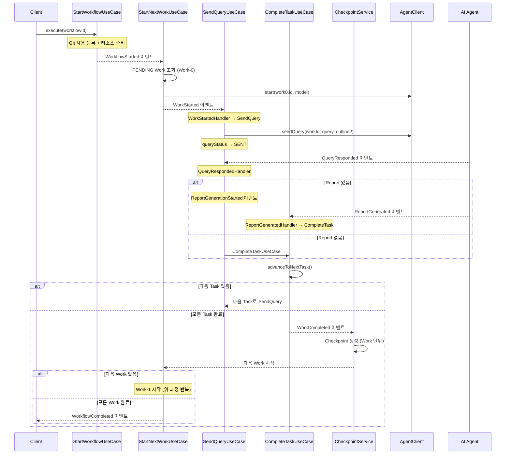
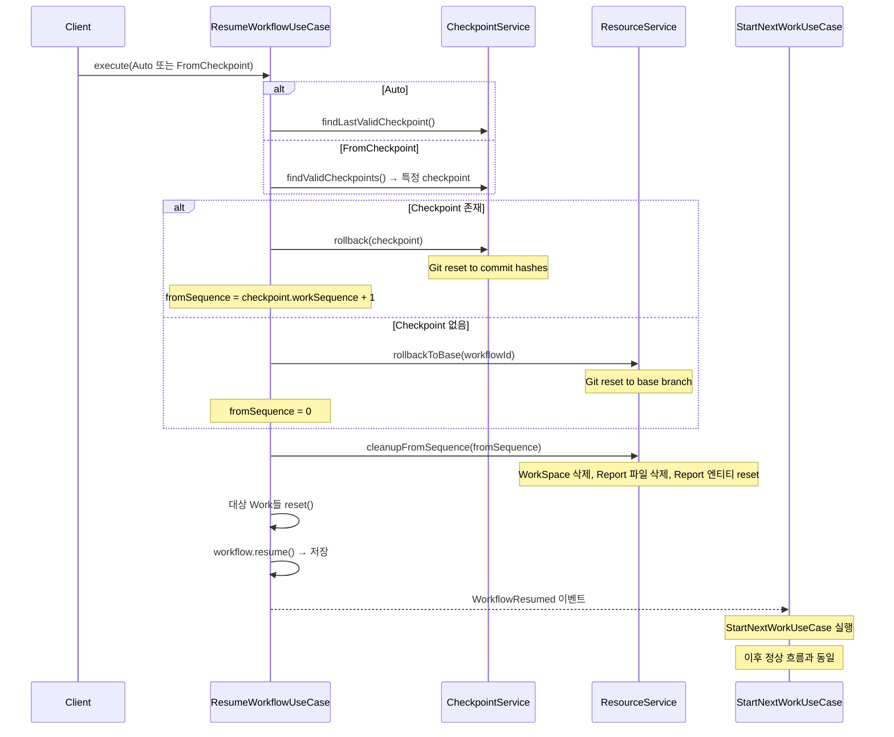
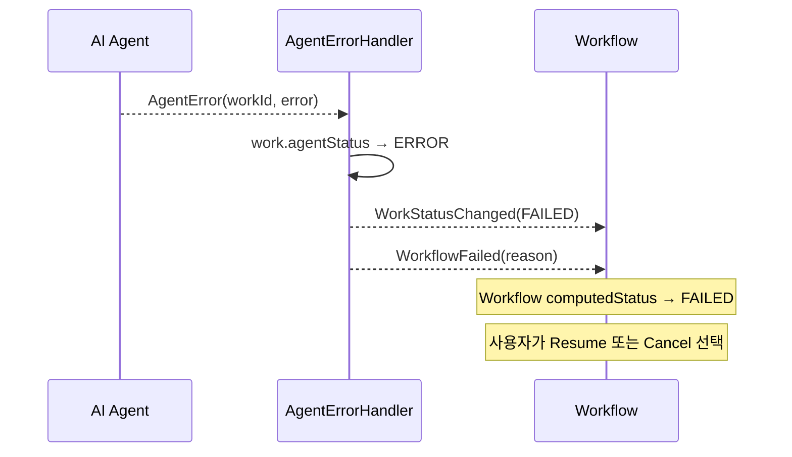
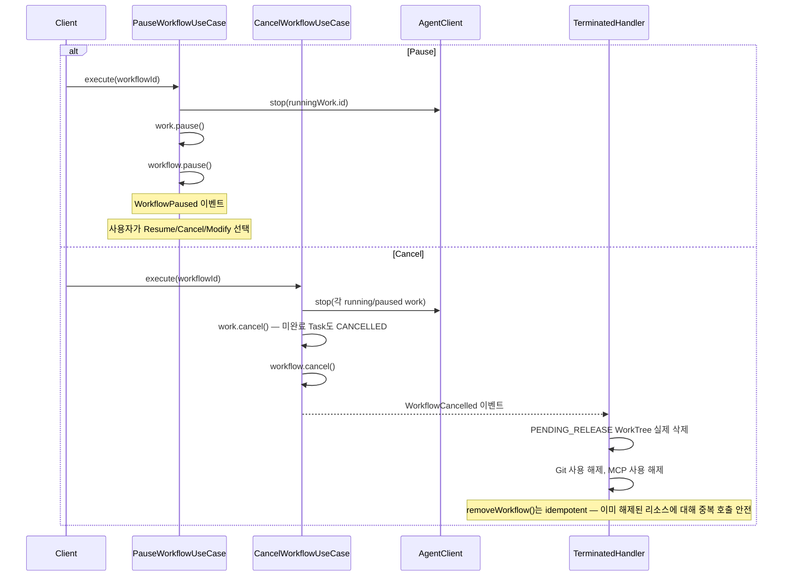

# 이벤트 흐름

## 1. 도메인 이벤트 카탈로그

### Git 이벤트
| 이벤트 | 발행자 | 페이로드 |
|--------|--------|---------|
| `GitCreated` | CreateGitUseCase | gitId |
| `GitDeleted` | DeleteGitUseCase | gitId |

### WorkflowTemplate 이벤트
| 이벤트 | 발행자 | 페이로드 |
|--------|--------|---------|
| `WorkflowTemplateCreated` | CreateWorkflowTemplateUseCase, CreateTemplateFromWorkflowUseCase | templateId |
| `WorkflowTemplateUpdated` | UpdateWorkflowTemplateUseCase | templateId |
| `WorkflowTemplateDeleted` | DeleteWorkflowTemplateUseCase | templateId |

### Workflow 이벤트
| 이벤트 | 발행자 | 페이로드 |
|--------|--------|---------|
| `WorkflowCreated` | CreateWorkflowUseCase | workflowId |
| `WorkflowStarted` | StartWorkflowUseCase | workflowId |
| `WorkflowPaused` | PauseWorkflowUseCase | workflowId |
| `WorkflowResumed` | ResumeWorkflowUseCase | workflowId, fromWorkId |
| `WorkflowCompleted` | StartNextWorkUseCase | workflowId |
| `WorkflowFailed` | AgentErrorHandler | workflowId, reason |
| `WorkflowCancelled` | CancelWorkflowUseCase | workflowId |
| `WorkflowGitRefsUpdated` | ModifyWorkflowUseCase | workflowId, addedRefs, removedRefs |
| `WorkflowMcpServerRefsUpdated` | ModifyWorkflowUseCase | workflowId, addedRefs, removedRefs |

### Work 이벤트
| 이벤트 | 발행자 | 페이로드 |
|--------|--------|---------|
| `WorkStatusChanged` | CompleteTaskUseCase, Agent*Handler | workId, workflowId, status |
| `WorkStarted` | StartNextWorkUseCase | workId, workflowId |
| `WorkCompleted` | CompleteTaskUseCase | workId, workflowId |

### Agent 이벤트 (외부 → 내부)
| 이벤트 | 발행자 | 페이로드 |
|--------|--------|---------|
| `AgentStarted` | Agent 프로세스 | workId |
| `AgentStopped` | Agent 프로세스 | workId |
| `AgentError` | Agent 프로세스 | workId, error |

### Task/Query 이벤트
| 이벤트 | 발행자 | 페이로드 |
|--------|--------|---------|
| `TaskStarted` | SendQueryUseCase | workId, taskId |
| `TaskCompleted` | CompleteTaskUseCase | workId, taskId |
| `QuerySent` | SendQueryUseCase | workId, taskId |
| `QueryResponded` | Agent 프로세스 | workId, taskId, response |
| `QueryFailed` | Agent 프로세스 | workId, taskId, error |

### Report 이벤트
| 이벤트 | 발행자 | 페이로드 |
|--------|--------|---------|
| `ReportGenerationStarted` | QueryRespondedHandler | reportId, taskId |
| `ReportGenerated` | Report 생성 프로세스 | reportId, taskId, filePath |
| `ReportFailed` | Report 생성 프로세스 | reportId, taskId, error |

### Checkpoint 이벤트
| 이벤트 | 발행자 | 페이로드 |
|--------|--------|---------|
| `CheckpointCreated` | CheckpointService | checkpointId, workflowId, workId |

### Resource 이벤트
| 이벤트 | 발행자 | 페이로드 |
|--------|--------|---------|
| `WorkTreeCreated` | WorkflowResourceService | workTreeId, workflowId |
| `WorkTreeFailed` | WorkflowResourceService | workTreeId, workflowId, error |
| `WorkTreePendingRelease` | ModifyWorkflowUseCase | workTreeId, workflowId, gitId |
| `WorkTreeReleased` | WorkflowResourceService | workTreeId, workflowId |
| `WorkSpaceCreated` | WorkflowResourceService | workSpaceId, workId |

---

## 2. 이벤트 → 핸들러 매핑

| 이벤트 | 핸들러 | 동작 |
|--------|--------|------|
| `WorkStatusChanged` | `WorkStatusChangedHandler` | Workflow의 workStatuses 업데이트 |
| `WorkStarted` | `WorkStartedHandler` | 첫 Task의 Query 전송 (SendQueryUseCase) |
| `WorkCompleted` | `WorkCompletedHandler` | Checkpoint 생성 → 다음 Work 시작 |
| `WorkTreeCreated` | `WorkTreeStatusChangedHandler` | Workflow의 workTreeStatuses → READY |
| `WorkTreeFailed` | `WorkTreeStatusChangedHandler` | Workflow의 workTreeStatuses → FAILED |
| `WorkflowCompleted` | `WorkflowTerminatedHandler` | Git 사용 해제, MCP 사용 해제, PENDING_RELEASE WorkTree 실제 삭제 |
| `WorkflowCancelled` | `WorkflowTerminatedHandler` | Git 사용 해제, MCP 사용 해제, PENDING_RELEASE WorkTree 실제 삭제 |
| `WorkflowFailed` | `WorkflowTerminatedHandler` | Git 사용 해제, MCP 사용 해제, PENDING_RELEASE WorkTree 실제 삭제 |
| `WorkTreePendingRelease` | `WorkTreeStatusChangedHandler` | Workflow의 workTreeStatuses 해당 GitId → PENDING_RELEASE |
| `AgentStarted` | `AgentStartedHandler` | Work의 agentStatus → RUNNING, WorkStatusChanged 발행 |
| `AgentStopped` | `AgentStoppedHandler` | Work의 agentStatus → STOPPED, WorkStatusChanged 발행 |
| `AgentError` | `AgentErrorHandler` | Work의 agentStatus → ERROR, WorkStatusChanged + WorkflowFailed 발행 |
| `TaskStarted` | (핸들러 없음 — UI 알림 전용) | WebSocket/SSE를 통해 UI에 Task 시작 상태 전파. 별도 도메인 로직 없음 |
| `QueryResponded` | `QueryRespondedHandler` | Report 있으면 생성 시작, 없으면 Task 완료 |
| `QueryFailed` | `QueryFailedHandler` | queryStatus → FAILED, WorkStatusChanged 발행 |
| `ReportGenerated` | `ReportGeneratedHandler` | Report 완료 → Task 완료 → 다음 Task Query 전송 |
| `ReportFailed` | `ReportFailedHandler` | reportStatus → FAILED, WorkStatusChanged 발행 |
| `WorkflowGitRefsUpdated` | `WorkflowGitRefsUpdatedHandler` | READY 상태에서 added가 있으면 PREPARING 전이 후 WorkTree 생성 트리거. 생성 완료 시 READY 복귀 |
| `WorkflowMcpServerRefsUpdated` | (UI 알림 전용) | UI 상태 갱신. 다음 Work 시작 시 병합 설정에 자동 반영 |
| `GitDeleted` | `GitDeletedHandler` | 모든 WorkflowTemplate에서 해당 gitId의 gitRef 캐스케이딩 제거 |
| `McpServerUnregistered` | `McpServerUnregisteredHandler` | 모든 WorkflowTemplate에서 해당 mcpServerId의 mcpServerRef 캐스케이딩 제거 |

---

## 3. 주요 실행 흐름

### 3.1 정상 실행 흐름



### 3.2 Resume 흐름



### 3.3 실패 흐름



### 3.4 Pause/Cancel 흐름



---

## 4. 이벤트 체인 요약

```
WorkflowStarted
  └→ StartNextWorkUseCase
       └→ WorkStarted
            └→ SendQueryUseCase (Task-0)
                 └→ QuerySent
                      └→ [Agent 처리]
                           └→ QueryResponded
                                ├→ (Report 없음) CompleteTaskUseCase
                                │    └→ TaskCompleted + WorkStatusChanged
                                │         ├→ (다음 Task) SendQueryUseCase
                                │         └→ (Work 완료) WorkCompleted
                                │              └→ CheckpointService.create
                                │                   └→ StartNextWorkUseCase
                                │                        ├→ (다음 Work) WorkStarted → ...
                                │                        └→ (전체 완료) WorkflowCompleted
                                └→ (Report 있음) ReportGenerationStarted
                                     └→ [Report 생성]
                                          └→ ReportGenerated
                                               └→ CompleteTaskUseCase → (위와 동일)
```

---

## 관련 문서
- [02-도메인-모델.md](02-도메인-모델.md) — 이벤트가 변경하는 Aggregate 상태
- [03-유스케이스.md](03-유스케이스.md) — 이벤트를 발행하는 유스케이스
- [05-인프라스트럭처.md](05-인프라스트럭처.md) — EventPublisher 구현
- [07-에러처리-및-복원력.md](07-에러처리-및-복원력.md) — 이벤트 체인 에러 전파 흐름
- [08-동시성-및-트랜잭션.md](08-동시성-및-트랜잭션.md) — 이벤트 순서 보장 및 Outbox Pattern
