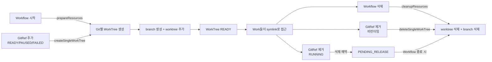
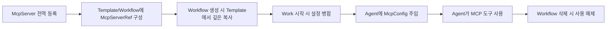
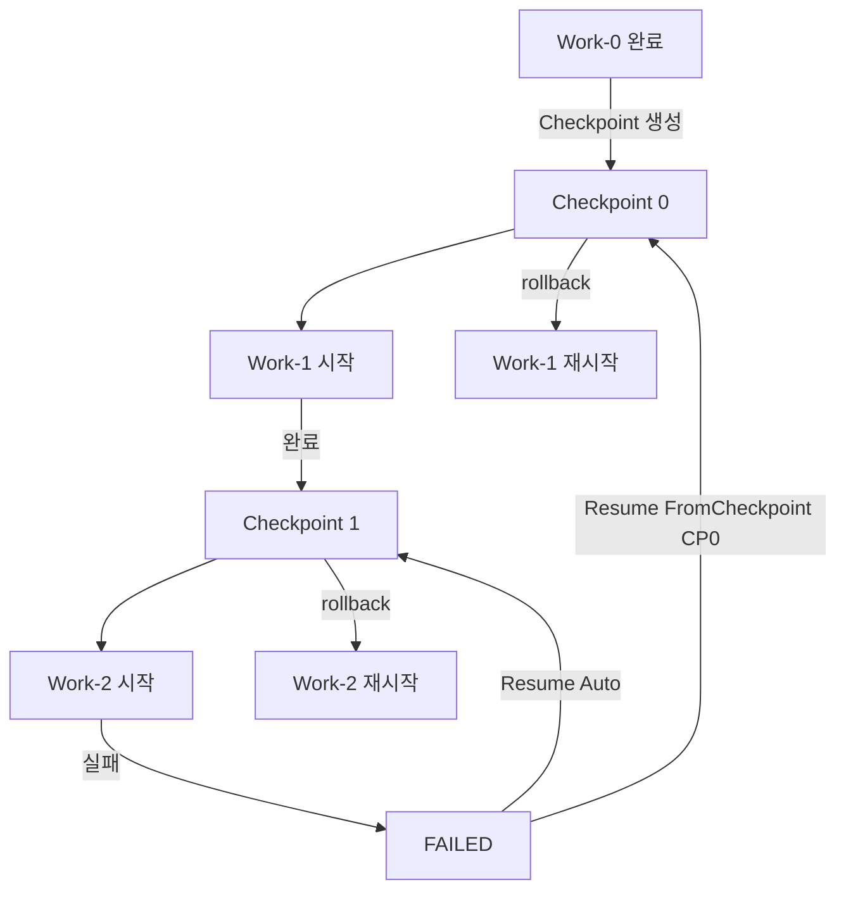

# 인프라스트럭처

## 1. Port 인터페이스

### 1.1 Repository Ports

| Repository | 주요 메서드 | 대상 Aggregate |
|-----------|-----------|--------------|
| `GitRepository` | save, findById, findByUrl, findAll, delete | Git |
| `WorkflowTemplateRepository` | save, findById, findAll, findByGitId, findByMcpServerId, delete | WorkflowTemplate |
| `WorkflowRepository` | save, findById, findByStatus, findByGitId, findAll, delete | Workflow |
| `WorkRepository` | save, findById, findByWorkflowId, findByTaskId, deleteByWorkflowId | Work (+Task) |
| `ReportRepository` | save, findById, findByTaskId, findByWorkflowId, delete, deleteByWorkflowId | Report |
| `CheckpointRepository` | save, findById, findByWorkflowId, findByWorkId, findLatestByWorkId, deleteByWorkflowId | Checkpoint |
| `WorkTreeRepository` | save, findById, findByWorkflowId, findByGitId, findByWorkflowIdAndGitId, deleteByWorkflowId | WorkTree |
| `WorkflowSpaceRepository` | save, findByWorkflowId, deleteByWorkflowId | WorkflowSpace (+WorkSpace) |
| `McpServerRepository` | save, findById, findAll, delete | McpServer |

**특이 메서드**
- `WorkRepository.findByTaskId(taskId)` — Event Handler에서 Task → Work 역방향 조회에 사용
- `CheckpointRepository.findLatestByWorkId(workId)` — Resume 시 최신 체크포인트 조회
- `WorkTreeRepository.findByWorkflowIdAndGitId(workflowId, gitId)` — GitRef 변경 시 캐스케이딩 대상 WorkTree 조회
- `WorkflowTemplateRepository.findByGitId(gitId)` — Git 삭제 시 캐스케이딩 대상 Template 조회
- `WorkflowTemplateRepository.findByMcpServerId(mcpServerId)` — McpServer 삭제 시 캐스케이딩 대상 Template 조회 (전역 + WorkDefinition 내부)

### 1.2 Infrastructure Ports

#### FileSystem
```typescript
interface FileSystem {
  createDirectory(path: string): Promise<void>;
  deleteDirectory(path: string): Promise<void>;
  deleteFile(path: string): Promise<void>;
  createSymlink(target: string, link: string): Promise<void>;
  deleteSymlink(link: string): Promise<void>;
  exists(path: string): Promise<boolean>;
}
```

#### GitClient
```typescript
interface GitClient {
  clone(url: GitUrl, path: string): Promise<void>;
  createWorktree(repoPath: string, worktreePath: string, branch: BranchName): Promise<void>;
  deleteWorktree(worktreePath: string): Promise<void>;
  createBranch(repoPath: string, branch: BranchName, baseBranch: BranchName): Promise<void>;
  deleteBranch(repoPath: string, branch: BranchName): Promise<void>;
  commit(worktreePath: string, message: string): Promise<CommitHash>;
  reset(worktreePath: string, commitHash: CommitHash): Promise<void>;
  resetToBranch(worktreePath: string, branch: BranchName): Promise<void>;
  hasChanges(worktreePath: string): Promise<boolean>;
  getCurrentCommit(worktreePath: string): Promise<CommitHash>;
  deleteRepo(path: string): Promise<void>;
}
```

#### AgentClient
```typescript
interface AgentClient {
  start(workId: WorkId, model: AgentModel, mcpConfig: McpConfig): Promise<void>;
  stop(workId: WorkId): Promise<void>;
  sendQuery(workId: WorkId, query: string, reportOutline?: ReportOutline): Promise<void>;
}

// Agent 시작 시 전달되는 MCP 설정
interface McpConfig {
  servers: McpServerEntry[];
}

interface McpServerEntry {
  name: string;
  command: string;
  args: string[];
  env: Record<string, string>;
  transportType: McpTransportType;
  url?: string;
}
```

#### McpClient
```typescript
interface McpClient {
  validate(command: string, args: string[], transportType: McpTransportType, url?: string): Promise<void>;
  listTools(mcpServerId: McpServerId): Promise<McpTool[]>;
}

interface McpTool {
  name: string;
  description: string;
  inputSchema: Record<string, unknown>;
}
```

#### EventPublisher
```typescript
interface EventPublisher {
  publish(event: DomainEvent): Promise<void>;
}
```

---

## 2. Domain Service → Port 의존성

| Domain Service | 사용하는 Port |
|---------------|-------------|
| `GitLifecycleService` | GitRepository, GitClient |
| `McpLifecycleService` | McpServerRepository, McpClient |
| `WorkflowResourceService` | WorkflowRepository, GitRepository, McpServerRepository, WorkTreeRepository, WorkflowSpaceRepository, WorkRepository, ReportRepository, FileSystem, GitClient, EventPublisher |

**McpLifecycleService 주요 메서드**
- `registerUsage(workflowId, mcpServerIds)` — Workflow 시작 시 사용하는 MCP 서버들에 `addWorkflow(workflowId)` 호출. Git의 `addWorkflow`와 대칭
- `releaseUsage(workflowId, mcpServerIds)` — Workflow 종료(완료/취소) 시 `removeWorkflow(workflowId)` 호출. 이미 해제된 경우 idempotent하게 무시
- `validate(mcpServerId)` — MCP 서버 등록/수정 시 연결 검증. `McpClient.validate()` 위임
- `listTools(mcpServerId)` — MCP 서버의 사용 가능한 도구 목록 조회. `McpClient.listTools()` 위임

**WorkflowResourceService 주요 메서드**
- `prepareResources(workflowId)` — Workflow 시작 시 전체 WorkTree 일괄 생성
- `cleanupResources(workflowId)` — Workflow 삭제 시 전체 WorkTree 일괄 삭제
- `prepareWorkSpace(workId)` — Work 시작 전 WorkSpace + symlink 구성
- `cleanupFromSequence(workflowId, fromSequence)` — Resume 시 특정 순서 이후 WorkSpace 정리
- `createSingleWorkTree(workflowId, gitRef, branchStrategy)` — GitRef 추가 시 단건 WorkTree 생성 (캐스케이딩용)
- `deleteSingleWorkTree(workTreeId)` — GitRef 제거 시 단건 WorkTree 삭제 (캐스케이딩용, 비런타임)
- `scheduleWorkTreeRelease(workTreeId)` — 런타임 중 GitRef 제거 시 WorkTree를 PENDING_RELEASE로 마킹 (삭제 예약)
- `releasePendingWorkTrees(workflowId)` — Workflow 종료 시 PENDING_RELEASE 상태의 WorkTree 일괄 삭제
| `CheckpointService` | CheckpointRepository, WorkflowRepository, WorkTreeRepository, GitClient, EventPublisher |

---

## 3. 리소스 관리 전략

### 3.1 WorkTree 생명주기

WorkTree는 **GitRef에 종속적**이며, WorkflowSpace 내에 물리적으로 생성된다. Work는 WorkSpace에서 symlink를 통해 접근한다.



- WorkTree는 GitRef에 종속적이다 — GitRef가 제거되면 WorkTree도 삭제 대상
- WorkTree는 WorkflowSpace 내에 물리적으로 존재하며, WorkSpace에서는 symlink로만 접근
- 하나의 Workflow 내 모든 Work가 동일한 WorkTree를 symlink로 공유
- WorkTree는 작업 브랜치(`branchStrategy.workBranch`) 위에서 동작
- **GitRef 제거 시 삭제 정책**:
  - **RUNNING 상태**: WorkTree를 `PENDING_RELEASE`로 마킹 (삭제 예약). Workflow 종료(COMPLETED/FAILED/CANCELLED) 시 실제 삭제
  - **그 외 상태**: WorkTree 즉시 삭제
- **GitRef 추가 시**: READY/PAUSED/FAILED 상태에서 WorkTree 즉시 생성, CREATED 상태에서는 시작 시 생성

### 3.2 MCP 설정 생명주기



**설정 병합 규칙** (StartNextWorkUseCase에서 수행)
1. Workflow의 `mcpServerRefs` (전역) 수집
2. 해당 Work의 `mcpServerRefs` (Work별) 수집
3. 동일 `mcpServerId`가 양쪽에 존재하면 Work별 `envOverrides`가 전역을 **덮어씀**
4. 병합된 `McpServerRef` 목록으로 `McpConfig` 생성 → Agent 시작 시 전달

**Git/WorkTree와의 대칭 비교**
```
Git      : 전역 리소스 → Workflow/Work 양쪽에서 GitRef로 참조 → WorkTree 물리 인스턴스화 → WorkSpace에서 symlink 접근
McpServer: 전역 리소스 → Workflow/Work 양쪽에서 McpServerRef로 참조 → 설정 병합 → Agent 시작 시 config로 주입
```

두 리소스 모두 **Workflow 레벨(전역)**과 **Work 레벨(개별)**에서 참조 가능하며, Work 시작 시 병합된다:
- **Git**: Workflow 전역 `gitRefs` + Work별 `gitRefs` → 병합된 GitRef 목록으로 WorkSpace symlink 대상 결정
- **MCP**: Workflow 전역 `mcpServerRefs` + Work별 `mcpServerRefs` → 병합된 설정으로 Agent에 주입

차이점:
- WorkTree는 **파일시스템 리소스**이므로 물리적 인스턴스(worktree 디렉토리)가 WorkflowSpace 내에 필요
- MCP는 **설정 리소스**이므로 물리적 인스턴스 없이 설정 병합으로 처리

### 3.3 WorkSpace 생명주기


- Work 시작 직전에 생성
- 기존 WorkSpace가 있으면 교체 (삭제 후 재생성)
- Resume 시 `fromSequence` 이후 WorkSpace 모두 정리

### 3.4 Checkpoint 전략



- **생성 시점**: Work 완료 시 (WorkCompletedHandler)
- **내용**: 모든 WorkTree의 현재 커밋 해시 스냅샷
- **커밋**: 변경사항이 있으면 자동 커밋 후 해시 저장
- **유효성**: Work 순서 변경 시 `workSequence` 불일치로 자동 무효화
- **롤백**: `git reset`으로 각 WorkTree를 Checkpoint 시점으로 복원

**GitRef 변경 시 Checkpoint 처리**
- **GitRef 제거**: 기존 Checkpoint의 `commitHashes`에서 해당 GitId 항목은 유지 (이력 보존). Resume 시 rollback은 현존하는 WorkTree에 대해서만 수행
- **GitRef 추가**: 기존 Checkpoint에 새 GitId 항목 없음. Resume 시 해당 WorkTree는 base branch로 reset (Checkpoint 없는 경우와 동일 동작)

---

## 4. 파일시스템 구조

```
/workflows/{workflowId}/                    # WorkflowSpace
├── reports/                                 # Report 파일 저장소
│   ├── report-{reportId-1}.md
│   └── report-{reportId-2}.md
├── work-0/                                  # WorkSpace (Work sequence 0)
│   ├── repo-{gitId-1} → symlink → /worktrees/{workflowId}/{gitId-1}
│   ├── repo-{gitId-2} → symlink → /worktrees/{workflowId}/{gitId-2}
│   └── (이전 Work의 Report symlink는 없음 — 첫 번째 Work)
├── work-1/                                  # WorkSpace (Work sequence 1)
│   ├── repo-{gitId-1} → symlink → /worktrees/{workflowId}/{gitId-1}
│   ├── repo-{gitId-2} → symlink → /worktrees/{workflowId}/{gitId-2}
│   └── report-{reportId-1} → symlink → /workflows/{workflowId}/reports/report-{reportId-1}.md
└── work-N/
    ├── repo-{gitId-*} → symlink
    └── report-{reportId-*} → symlink (이전 Work들의 Report 모두)

/worktrees/{workflowId}/                     # WorkTree 루트
├── {gitId-1}/                               # Git worktree (작업 브랜치)
└── {gitId-2}/                               # Git worktree (작업 브랜치)
```

### 핵심 설계 의도
- **WorkTree symlink**: Agent가 WorkSpace 내에서 Git 리포지토리에 접근
- **Report symlink**: 후속 Work의 Agent가 이전 Work의 Report 결과를 참조 가능
- **격리**: 각 Work는 자신의 WorkSpace에서만 작업. 이전 결과는 읽기 전용(symlink)으로 접근

---

## 5. Adapter 구현 가이드

### 5.1 Repository Adapter

| 옵션 | 적합한 경우 |
|------|-----------|
| **In-Memory** | 프로토타입, 테스트 |
| **Prisma** | 프로덕션, RDBMS (PostgreSQL, MySQL 등) |
| **Drizzle ORM** | 경량 ORM, SQL-first 접근 |
| **MongoDB (Mongoose)** | 도큐먼트 기반 저장 |

**Work + Task 저장 전략**: Work Aggregate가 Task를 내부에 포함하므로, 저장 시 Work와 Task를 함께 직렬화해야 한다.
- Prisma: 1:N 관계 또는 JSON 컬럼에 Task 목록 직렬화
- MongoDB: Work 문서 안에 Task 배열로 저장

### 5.2 GitClient Adapter

`child_process.execFile` / `execa`를 통한 `git` CLI 명령 실행이 가장 직관적:
- `git clone`, `git worktree add/remove`, `git branch`, `git commit`, `git reset`
- `simple-git` 라이브러리 사용도 가능하나 worktree 지원 확인 필요

### 5.3 AgentClient Adapter

Agent 프로세스 관리 방식:
- **프로세스 기반**: `child_process.spawn`으로 Agent CLI 실행 (예: Claude Code CLI)
- **HTTP 기반**: Agent가 별도 서비스로 실행 중인 경우 REST/gRPC 호출
- **메시지 큐 기반**: Agent 요청을 큐에 넣고 비동기 처리

Agent → 시스템 이벤트 전달:
- Agent 프로세스의 stdout/stderr 파싱
- Webhook/Callback URL
- 공유 파일시스템 상의 상태 파일 감시

### 5.4 McpClient Adapter

MCP 서버 연결 검증 및 도구 목록 조회:
- **STDIO**: `child_process.spawn`으로 MCP 서버 프로세스 실행 → `initialize` 핸드셰이크 → `tools/list` 호출
- **SSE/STREAMABLE_HTTP**: HTTP 클라이언트로 서버 URL에 연결 → MCP 프로토콜 핸드셰이크

Agent에 MCP 설정 전달 방식:
- **Claude Code CLI**: `--mcp-config` 플래그 또는 `.mcp.json` 파일 생성
- **커스텀 Agent**: 환경 변수 또는 설정 파일로 전달

### 5.5 EventPublisher Adapter

| 옵션 | 특징 |
|------|------|
| **EventEmitter (Node.js)** | 단일 프로세스, 동기/비동기 선택 |
| **BullMQ / Redis Pub/Sub** | 분산 환경, 이벤트 영속화 |
| **In-Memory EventBus** | 프로토타입, 테스트 |

---

## 관련 문서
- [01-서비스-개요.md](01-서비스-개요.md) — 전체 아키텍처 및 외부 의존성
- [02-도메인-모델.md](02-도메인-모델.md) — Port가 다루는 Aggregate 상세
- [04-이벤트-흐름.md](04-이벤트-흐름.md) — EventPublisher가 발행하는 이벤트
- [07-에러처리-및-복원력.md](07-에러처리-및-복원력.md) — 외부 의존성별 재시도/타임아웃/Circuit Breaker
- [10-운영-및-모니터링.md](10-운영-및-모니터링.md) — 인프라 설정 관리 및 배포 전략
