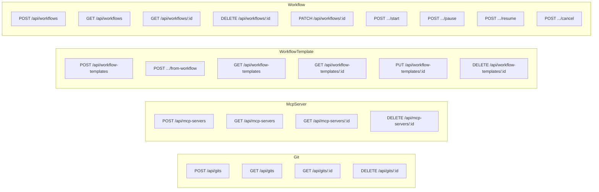
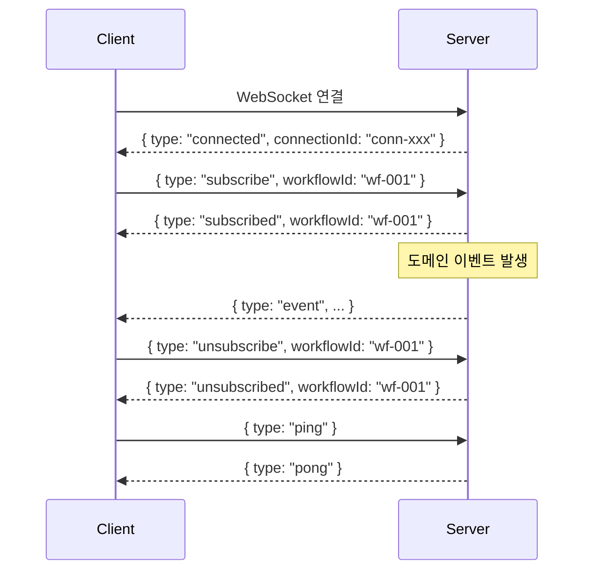
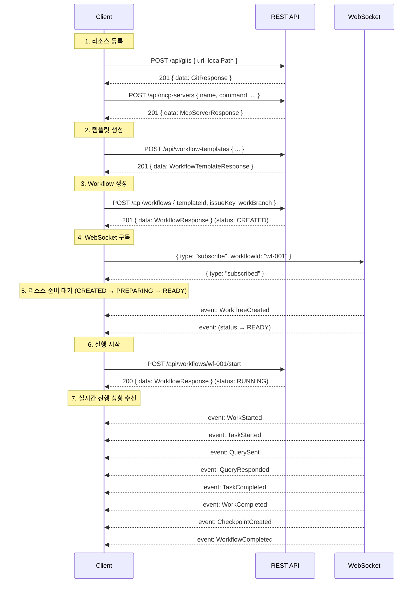
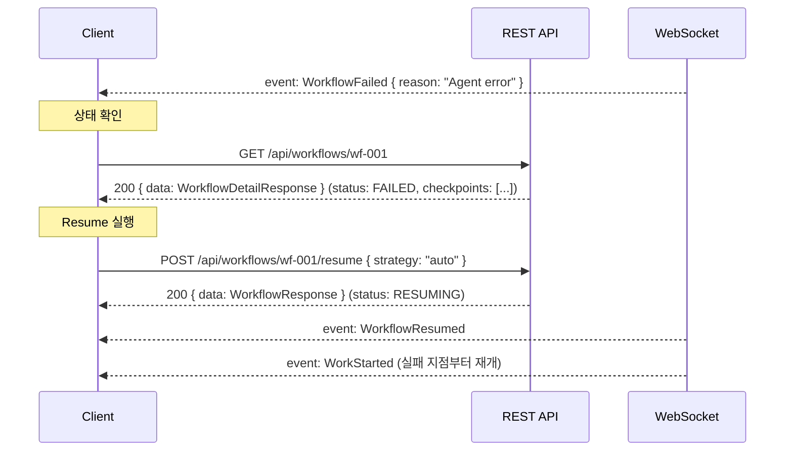

# API 설계

## 1. 설계 원칙

| 원칙 | 설명 |
|------|------|
| **UseCase 1:1 매핑** | 각 REST endpoint는 하나의 UseCase에 대응한다 |
| **Resource-oriented URL** | 리소스 중심 URL 설계. 동사는 lifecycle action에만 사용 |
| **Envelope Response** | 모든 응답은 공통 envelope 형식을 따른다 |
| **Cursor-based Pagination** | 목록 조회는 cursor 기반 페이지네이션 적용 |
| **Domain Event Streaming** | 실시간 이벤트는 WebSocket으로 전달 |

---

## 2. REST API 엔드포인트 전체 목록

### 2.1 Git

| UseCase | Method | URL | 설명 |
|---------|--------|-----|------|
| CreateGitUseCase | `POST` | `/api/gits` | Git 리포지토리 등록 (clone) |
| — (조회) | `GET` | `/api/gits` | Git 리포지토리 목록 조회 |
| — (단건 조회) | `GET` | `/api/gits/{gitId}` | Git 리포지토리 단건 조회 |
| DeleteGitUseCase | `DELETE` | `/api/gits/{gitId}` | Git 리포지토리 삭제 |

#### POST /api/gits

| 항목 | 내용 |
|------|------|
| **Request Body** | `{ url: string, localPath: string }` |
| **Response** | `GitResponse` |
| **성공 코드** | `201 Created` |
| **에러 코드** | `400` 잘못된 URL 형식, `409` 이미 등록된 URL |

#### GET /api/gits

| 항목 | 내용 |
|------|------|
| **Query Params** | `cursor?: string`, `limit?: number` (기본 20, 최대 100) |
| **Response** | `PaginatedResponse<GitResponse>` |
| **성공 코드** | `200 OK` |

#### GET /api/gits/{gitId}

| 항목 | 내용 |
|------|------|
| **Path Params** | `gitId: string` |
| **Response** | `GitResponse` |
| **성공 코드** | `200 OK` |
| **에러 코드** | `404` 존재하지 않는 Git |

#### DELETE /api/gits/{gitId}

| 항목 | 내용 |
|------|------|
| **Path Params** | `gitId: string` |
| **Response** | `void` |
| **성공 코드** | `204 No Content` |
| **에러 코드** | `404` 존재하지 않음, `409` 사용 중인 Workflow 존재 |

---

### 2.2 McpServer

| UseCase | Method | URL | 설명 |
|---------|--------|-----|------|
| RegisterMcpServerUseCase | `POST` | `/api/mcp-servers` | MCP 서버 등록 |
| — (조회) | `GET` | `/api/mcp-servers` | MCP 서버 목록 조회 |
| — (단건 조회) | `GET` | `/api/mcp-servers/{mcpServerId}` | MCP 서버 단건 조회 |
| UnregisterMcpServerUseCase | `DELETE` | `/api/mcp-servers/{mcpServerId}` | MCP 서버 삭제 |

#### POST /api/mcp-servers

| 항목 | 내용 |
|------|------|
| **Request Body** | `{ name: string, command: string, args: string[], env: Record<string, string>, transportType: McpTransportType, url?: string }` |
| **Response** | `McpServerResponse` |
| **성공 코드** | `201 Created` |
| **에러 코드** | `400` 잘못된 입력, `422` 연결 검증 실패 |

#### GET /api/mcp-servers

| 항목 | 내용 |
|------|------|
| **Query Params** | `cursor?: string`, `limit?: number` |
| **Response** | `PaginatedResponse<McpServerResponse>` |
| **성공 코드** | `200 OK` |

#### GET /api/mcp-servers/{mcpServerId}

| 항목 | 내용 |
|------|------|
| **Path Params** | `mcpServerId: string` |
| **Response** | `McpServerResponse` |
| **성공 코드** | `200 OK` |
| **에러 코드** | `404` 존재하지 않는 McpServer |

#### DELETE /api/mcp-servers/{mcpServerId}

| 항목 | 내용 |
|------|------|
| **Path Params** | `mcpServerId: string` |
| **Response** | `void` |
| **성공 코드** | `204 No Content` |
| **에러 코드** | `404` 존재하지 않음, `409` 사용 중인 Workflow 존재 |

---

### 2.3 WorkflowTemplate

| UseCase | Method | URL | 설명 |
|---------|--------|-----|------|
| CreateWorkflowTemplateUseCase | `POST` | `/api/workflow-templates` | 템플릿 생성 |
| CreateTemplateFromWorkflowUseCase | `POST` | `/api/workflow-templates/from-workflow` | Workflow에서 템플릿 생성 |
| — (목록 조회) | `GET` | `/api/workflow-templates` | 템플릿 목록 조회 |
| — (단건 조회) | `GET` | `/api/workflow-templates/{templateId}` | 템플릿 단건 조회 |
| UpdateWorkflowTemplateUseCase | `PUT` | `/api/workflow-templates/{templateId}` | 템플릿 수정 |
| DeleteWorkflowTemplateUseCase | `DELETE` | `/api/workflow-templates/{templateId}` | 템플릿 삭제 |

#### POST /api/workflow-templates

| 항목 | 내용 |
|------|------|
| **Request Body** | `CreateWorkflowTemplateRequest` |
| **Response** | `WorkflowTemplateResponse` |
| **성공 코드** | `201 Created` |
| **에러 코드** | `400` 유효성 검증 실패, `404` 참조된 Git/McpServer 미존재 |

#### POST /api/workflow-templates/from-workflow

| 항목 | 내용 |
|------|------|
| **Request Body** | `{ workflowId: string, name: string, description: string }` |
| **Response** | `WorkflowTemplateResponse` |
| **성공 코드** | `201 Created` |
| **에러 코드** | `404` Workflow 미존재 |

#### GET /api/workflow-templates

| 항목 | 내용 |
|------|------|
| **Query Params** | `cursor?: string`, `limit?: number` |
| **Response** | `PaginatedResponse<WorkflowTemplateSummaryResponse>` |
| **성공 코드** | `200 OK` |

#### GET /api/workflow-templates/{templateId}

| 항목 | 내용 |
|------|------|
| **Path Params** | `templateId: string` |
| **Response** | `WorkflowTemplateResponse` |
| **성공 코드** | `200 OK` |
| **에러 코드** | `404` 존재하지 않는 Template |

#### PUT /api/workflow-templates/{templateId}

| 항목 | 내용 |
|------|------|
| **Request Body** | `UpdateWorkflowTemplateRequest` |
| **Response** | `WorkflowTemplateResponse` |
| **성공 코드** | `200 OK` |
| **에러 코드** | `400` 유효성 검증 실패, `404` Template/Git/McpServer 미존재 |

#### DELETE /api/workflow-templates/{templateId}

| 항목 | 내용 |
|------|------|
| **Path Params** | `templateId: string` |
| **Response** | `void` |
| **성공 코드** | `204 No Content` |
| **에러 코드** | `404` 존재하지 않음 |

---

### 2.4 Workflow

| UseCase | Method | URL | 설명 |
|---------|--------|-----|------|
| CreateWorkflowUseCase | `POST` | `/api/workflows` | Workflow 인스턴스 생성 |
| — (목록 조회) | `GET` | `/api/workflows` | Workflow 목록 조회 |
| — (단건 조회) | `GET` | `/api/workflows/{workflowId}` | Workflow 상세 조회 |
| StartWorkflowUseCase | `POST` | `/api/workflows/{workflowId}/start` | Workflow 실행 시작 |
| PauseWorkflowUseCase | `POST` | `/api/workflows/{workflowId}/pause` | Workflow 일시정지 |
| ResumeWorkflowUseCase | `POST` | `/api/workflows/{workflowId}/resume` | Workflow 재개 |
| CancelWorkflowUseCase | `POST` | `/api/workflows/{workflowId}/cancel` | Workflow 취소 |
| DeleteWorkflowUseCase | `DELETE` | `/api/workflows/{workflowId}` | Workflow 삭제 |
| ModifyWorkflowUseCase | `PATCH` | `/api/workflows/{workflowId}` | Workflow 구조 수정 |

#### POST /api/workflows

| 항목 | 내용 |
|------|------|
| **Request Body** | `{ templateId: string, issueKey: string, workBranch: string }` |
| **Response** | `WorkflowResponse` |
| **성공 코드** | `201 Created` |
| **에러 코드** | `404` Template/Git 미존재 |

#### GET /api/workflows

| 항목 | 내용 |
|------|------|
| **Query Params** | `cursor?: string`, `limit?: number`, `status?: WorkflowStatus` |
| **Response** | `PaginatedResponse<WorkflowSummaryResponse>` |
| **성공 코드** | `200 OK` |

#### GET /api/workflows/{workflowId}

| 항목 | 내용 |
|------|------|
| **Path Params** | `workflowId: string` |
| **Response** | `WorkflowDetailResponse` |
| **성공 코드** | `200 OK` |
| **에러 코드** | `404` 존재하지 않는 Workflow |

> `WorkflowDetailResponse`는 하위 Work/Task 정보를 포함한 중첩 구조로 반환한다.

#### POST /api/workflows/{workflowId}/start

| 항목 | 내용 |
|------|------|
| **Request Body** | 없음 |
| **Response** | `WorkflowResponse` |
| **성공 코드** | `200 OK` |
| **에러 코드** | `404` Workflow 미존재, `409` READY 상태가 아님 |

#### POST /api/workflows/{workflowId}/pause

| 항목 | 내용 |
|------|------|
| **Request Body** | 없음 |
| **Response** | `WorkflowResponse` |
| **성공 코드** | `200 OK` |
| **에러 코드** | `404` Workflow 미존재, `409` RUNNING 상태가 아님 |

#### POST /api/workflows/{workflowId}/resume

| 항목 | 내용 |
|------|------|
| **Request Body** | `{ strategy: "auto" } \| { strategy: "fromCheckpoint", checkpointId: string }` |
| **Response** | `WorkflowResponse` |
| **성공 코드** | `200 OK` |
| **에러 코드** | `404` Workflow/Checkpoint 미존재, `409` PAUSED/FAILED 상태가 아님 |

#### POST /api/workflows/{workflowId}/cancel

| 항목 | 내용 |
|------|------|
| **Request Body** | 없음 |
| **Response** | `WorkflowResponse` |
| **성공 코드** | `200 OK` |
| **에러 코드** | `404` Workflow 미존재, `409` 취소 불가능한 상태 |

#### DELETE /api/workflows/{workflowId}

| 항목 | 내용 |
|------|------|
| **Path Params** | `workflowId: string` |
| **Response** | `void` |
| **성공 코드** | `204 No Content` |
| **에러 코드** | `404` 존재하지 않음, `409` 삭제 불가능한 상태 (RUNNING/PAUSED 등) |

---

### 2.5 Workflow Modify (PATCH)

`PATCH /api/workflows/{workflowId}` 엔드포인트는 `operation` 필드로 sub-operation을 구분한다. 모든 Modify 연산은 Workflow가 `CREATED`, `READY`, `PAUSED`, `FAILED` 상태일 때만 허용된다.

| Sub-operation | operation 값 | 설명 |
|---------------|-------------|------|
| AddTask | `addTask` | Work에 새 Task 추가 |
| RemoveTask | `removeTask` | Work에서 Task 제거 |
| UpdateTask | `updateTask` | Task의 query 수정 |
| ReorderTasks | `reorderTasks` | Work 내 Task 순서 변경 |
| UpdateGitRefs | `updateGitRefs` | Workflow Git 참조 변경 |
| UpdateMcpServerRefs | `updateMcpServerRefs` | Workflow 전역 MCP 서버 참조 변경 |

#### PATCH /api/workflows/{workflowId} -- addTask

```json
{
  "operation": "addTask",
  "workId": "work-123",
  "order": 2,
  "query": "컴포넌트 단위 테스트를 작성하세요",
  "reportOutline": {
    "sections": [
      { "title": "테스트 결과", "description": "테스트 실행 결과 요약" }
    ]
  }
}
```

| 항목 | 내용 |
|------|------|
| **성공 코드** | `200 OK` |
| **Response** | `WorkflowDetailResponse` |
| **에러 코드** | `404` Workflow/Work 미존재, `409` 수정 불가능한 상태 |

#### PATCH /api/workflows/{workflowId} -- removeTask

```json
{
  "operation": "removeTask",
  "workId": "work-123",
  "taskId": "task-456"
}
```

| 항목 | 내용 |
|------|------|
| **성공 코드** | `200 OK` |
| **Response** | `WorkflowDetailResponse` |
| **에러 코드** | `404` Workflow/Work/Task 미존재, `409` 수정 불가능한 상태 |

#### PATCH /api/workflows/{workflowId} -- updateTask

```json
{
  "operation": "updateTask",
  "workId": "work-123",
  "taskId": "task-456",
  "query": "수정된 프롬프트 내용"
}
```

| 항목 | 내용 |
|------|------|
| **성공 코드** | `200 OK` |
| **Response** | `WorkflowDetailResponse` |
| **에러 코드** | `404` Workflow/Work/Task 미존재, `409` 수정 불가능한 상태 |

#### PATCH /api/workflows/{workflowId} -- reorderTasks

```json
{
  "operation": "reorderTasks",
  "workId": "work-123",
  "taskIds": ["task-789", "task-456", "task-123"]
}
```

| 항목 | 내용 |
|------|------|
| **성공 코드** | `200 OK` |
| **Response** | `WorkflowDetailResponse` |
| **에러 코드** | `400` taskIds가 기존 목록과 불일치, `404` Workflow/Work 미존재, `409` 수정 불가능한 상태 |

#### PATCH /api/workflows/{workflowId} -- updateGitRefs

```json
{
  "operation": "updateGitRefs",
  "gitRefs": [
    { "gitId": "git-001", "baseBranch": "main" },
    { "gitId": "git-002", "baseBranch": "develop" }
  ]
}
```

| 항목 | 내용 |
|------|------|
| **성공 코드** | `200 OK` |
| **Response** | `WorkflowDetailResponse` |
| **에러 코드** | `400` gitRefs 비어있음/중복 gitId, `404` Workflow/Git 미존재, `409` 수정 불가능한 상태 |

#### PATCH /api/workflows/{workflowId} -- updateMcpServerRefs

```json
{
  "operation": "updateMcpServerRefs",
  "mcpServerRefs": [
    { "mcpServerId": "mcp-001", "envOverrides": { "API_KEY": "new-key" } },
    { "mcpServerId": "mcp-002", "envOverrides": {} }
  ]
}
```

| 항목 | 내용 |
|------|------|
| **성공 코드** | `200 OK` |
| **Response** | `WorkflowDetailResponse` |
| **에러 코드** | `404` Workflow/McpServer 미존재, `409` 수정 불가능한 상태 |

---

### 2.6 Work (내부 UseCase — REST 미노출)

`StartNextWorkUseCase`와 `ReorderWorksUseCase`는 내부 이벤트 핸들러 또는 Workflow Modify를 통해 호출되므로 별도 REST endpoint를 노출하지 않는다.

| UseCase | 호출 경로 | 비고 |
|---------|----------|------|
| StartNextWorkUseCase | `WorkflowStarted` / `WorkCompleted` 이벤트 핸들러 | 자동 트리거 |
| ReorderWorksUseCase | `PATCH /api/workflows/{id}` 확장 가능 | 필요 시 Modify sub-operation 추가 |

### 2.7 Task (내부 UseCase — REST 미노출)

`SendQueryUseCase`와 `CompleteTaskUseCase`는 이벤트 체인에 의해 자동 실행되므로 별도 REST endpoint를 노출하지 않는다.

| UseCase | 호출 경로 | 비고 |
|---------|----------|------|
| SendQueryUseCase | `WorkStarted` 이벤트 핸들러 | 자동 트리거 |
| CompleteTaskUseCase | `QueryResponded` / `ReportGenerated` 이벤트 핸들러 | 자동 트리거 |

---

### 2.8 엔드포인트 요약



---

## 3. 공통 응답 형식

### 3.1 성공 응답 Envelope

```typescript
// 단건 응답
interface ApiResponse<T> {
  success: true;
  data: T;
  timestamp: string; // ISO 8601
}

// 목록 응답 (페이지네이션 포함)
interface PaginatedResponse<T> {
  success: true;
  data: T[];
  pagination: {
    nextCursor: string | null;
    hasMore: boolean;
    limit: number;
  };
  timestamp: string;
}
```

### 3.2 에러 응답 Envelope

```typescript
interface ErrorResponse {
  success: false;
  error: {
    code: string;       // 도메인별 에러 코드 (예: "GIT_001")
    message: string;    // 사람이 읽을 수 있는 메시지
    details?: unknown;  // 추가 에러 정보 (validation errors 등)
  };
  timestamp: string;
}
```

### 3.3 에러 코드 체계

도메인별 prefix를 사용하여 에러 코드를 체계적으로 분류한다.

| Prefix | 도메인 | 예시 |
|--------|--------|------|
| `GIT_` | Git | `GIT_001` URL 형식 오류, `GIT_002` 이미 등록된 URL, `GIT_003` 사용 중 삭제 시도 |
| `MCP_` | McpServer | `MCP_001` 연결 검증 실패, `MCP_002` 사용 중 삭제 시도 |
| `TPL_` | WorkflowTemplate | `TPL_001` 참조 Git 미존재, `TPL_002` 참조 McpServer 미존재 |
| `WFL_` | Workflow | `WFL_001` Template 미존재, `WFL_002` 상태 전이 불가, `WFL_003` Git 미존재 |
| `MOD_` | Modify | `MOD_001` 수정 불가 상태, `MOD_002` 대상 Work 미존재, `MOD_003` 대상 Task 미존재 |
| `SYS_` | 시스템 | `SYS_001` 내부 서버 오류, `SYS_002` 요청 형식 오류, `SYS_003` 인증 실패 |

### 3.4 HTTP 상태코드 매핑

| HTTP Status | 사용 조건 | 에러 코드 예시 |
|-------------|----------|--------------|
| `200 OK` | 조회/수정/lifecycle action 성공 | — |
| `201 Created` | 리소스 생성 성공 | — |
| `204 No Content` | 삭제 성공 | — |
| `400 Bad Request` | 요청 형식/유효성 검증 실패 | `SYS_002`, `GIT_001` |
| `404 Not Found` | 대상 리소스 미존재 | `TPL_001`, `WFL_001` |
| `409 Conflict` | 상태 충돌 (삭제 불가, 전이 불가) | `GIT_003`, `WFL_002` |
| `422 Unprocessable Entity` | 비즈니스 규칙 위반 | `MCP_001` |
| `500 Internal Server Error` | 서버 내부 오류 | `SYS_001` |

---

## 4. WebSocket 프로토콜

### 4.1 연결

```
WS /ws/events?token={authToken}
```

클라이언트는 WebSocket 연결 후 구독 메시지를 전송하여 관심 있는 Workflow의 이벤트를 수신한다.

### 4.2 메시지 프로토콜



### 4.3 메시지 형식

#### Client -> Server 메시지

```typescript
// 구독
interface SubscribeMessage {
  type: "subscribe";
  workflowId: string;
}

// 구독 해제
interface UnsubscribeMessage {
  type: "unsubscribe";
  workflowId: string;
}

// 전체 이벤트 구독 (Git, McpServer, WorkflowTemplate 등 글로벌 이벤트)
interface SubscribeGlobalMessage {
  type: "subscribeGlobal";
}

// Heartbeat
interface PingMessage {
  type: "ping";
}
```

#### Server -> Client 메시지

```typescript
// 연결 확인
interface ConnectedMessage {
  type: "connected";
  connectionId: string;
}

// 구독 확인
interface SubscribedMessage {
  type: "subscribed";
  workflowId: string;
}

// 도메인 이벤트
interface EventMessage {
  type: "event";
  event: {
    name: string;              // 이벤트 이름 (예: "WorkflowStarted")
    payload: Record<string, unknown>;
    timestamp: string;         // ISO 8601
    sequenceNumber: number;    // 순서 보장용 시퀀스
  };
}

// Heartbeat 응답
interface PongMessage {
  type: "pong";
}

// 에러
interface WsErrorMessage {
  type: "error";
  code: string;
  message: string;
}
```

### 4.4 전달 대상 도메인 이벤트

| 구독 유형 | 전달 이벤트 |
|----------|-----------|
| **Global** | `GitCreated`, `GitDeleted`, `McpServerRegistered`, `McpServerUnregistered`, `WorkflowTemplateCreated`, `WorkflowTemplateUpdated`, `WorkflowTemplateDeleted`, `WorkflowCreated` |
| **Workflow별** | `WorkflowStarted`, `WorkflowPaused`, `WorkflowResumed`, `WorkflowCompleted`, `WorkflowFailed`, `WorkflowCancelled`, `WorkflowGitRefsUpdated`, `WorkflowMcpServerRefsUpdated`, `WorkStarted`, `WorkCompleted`, `WorkStatusChanged`, `TaskStarted`, `TaskCompleted`, `QuerySent`, `QueryResponded`, `QueryFailed`, `ReportGenerationStarted`, `ReportGenerated`, `ReportFailed`, `CheckpointCreated`, `WorkTreeCreated`, `WorkTreeFailed`, `WorkTreeReleased` |

### 4.5 Heartbeat 전략

| 항목 | 값 |
|------|---|
| **Client ping 주기** | 30초 |
| **Server pong 타임아웃** | 10초 (응답 없으면 재연결) |
| **Server idle 타임아웃** | 60초 (ping 없으면 연결 종료) |

### 4.6 재연결 전략

클라이언트는 연결 끊김 시 Exponential Backoff로 재연결한다.

| 항목 | 값 |
|------|---|
| **초기 대기** | 1초 |
| **최대 대기** | 30초 |
| **Backoff 배수** | 2x |
| **Jitter** | 0~500ms 랜덤 추가 |
| **최대 재시도** | 무제한 (UI에서 수동 중단 가능) |

재연결 시 클라이언트는 마지막으로 수신한 `sequenceNumber`를 전송하여 누락된 이벤트를 재수신할 수 있다.

```typescript
interface ReconnectSubscribeMessage {
  type: "subscribe";
  workflowId: string;
  lastSequenceNumber?: number; // 이후 이벤트부터 재전송 요청
}
```

---

## 5. 페이지네이션

### 5.1 Cursor-based Pagination

목록 조회 API는 cursor 기반 페이지네이션을 사용한다. Offset 기반 대비 대용량 데이터에서 일관된 성능을 보장한다.

#### 요청 파라미터

| Parameter | Type | Default | 설명 |
|-----------|------|---------|------|
| `cursor` | `string` | (없음 — 첫 페이지) | 이전 응답의 `nextCursor` 값 |
| `limit` | `number` | `20` | 한 페이지 항목 수 (최소 1, 최대 100) |

#### 응답 구조

```typescript
interface PaginationMeta {
  nextCursor: string | null; // 다음 페이지 커서 (null이면 마지막 페이지)
  hasMore: boolean;          // 다음 페이지 존재 여부
  limit: number;             // 적용된 limit 값
}
```

#### 커서 구현

커서는 `createdAt` 타임스탬프와 `id`를 Base64 인코딩한 opaque string이다. 클라이언트는 커서의 내부 구조에 의존하지 않는다.

```
cursor = base64encode(JSON.stringify({ createdAt: "2025-01-15T10:30:00Z", id: "wf-001" }))
```

### 5.2 적용 엔드포인트

| Endpoint | 정렬 기준 | 추가 필터 |
|----------|----------|----------|
| `GET /api/gits` | `createdAt DESC` | — |
| `GET /api/mcp-servers` | `createdAt DESC` | — |
| `GET /api/workflow-templates` | `createdAt DESC` | — |
| `GET /api/workflows` | `createdAt DESC` | `status` (선택) |

---

## 6. Request/Response DTO

### 6.1 공통 타입

```typescript
// 공통 ID 타입 (모두 string)
type GitId = string;
type McpServerId = string;
type WorkflowTemplateId = string;
type WorkflowId = string;
type WorkId = string;
type TaskId = string;
type ReportId = string;
type CheckpointId = string;

// 복합 값 객체
interface GitRefDto {
  gitId: GitId;
  baseBranch: string;
}

interface McpServerRefDto {
  mcpServerId: McpServerId;
  envOverrides: Record<string, string>;
}

interface ReportOutlineDto {
  sections: SectionDto[];
}

interface SectionDto {
  title: string;
  description: string;
}
```

### 6.2 Git DTO

```typescript
// Response
interface GitResponse {
  id: GitId;
  url: string;
  localPath: string;
  activeWorkflowCount: number;
  createdAt: string;
}
```

### 6.3 McpServer DTO

```typescript
// Response
interface McpServerResponse {
  id: McpServerId;
  name: string;
  command: string;
  args: string[];
  env: Record<string, string>;
  transportType: "STDIO" | "SSE" | "STREAMABLE_HTTP";
  url: string | null;
  activeWorkflowCount: number;
  createdAt: string;
}
```

### 6.4 WorkflowTemplate DTO

```typescript
// Request — 생성
interface CreateWorkflowTemplateRequest {
  name: string;
  description: string;
  workDefinitions: WorkDefinitionDto[];
  gitRefs: GitRefDto[];
  mcpServerRefs: McpServerRefDto[];
}

// Request — 수정
interface UpdateWorkflowTemplateRequest {
  name?: string;
  description?: string;
  workDefinitions?: WorkDefinitionDto[];
  gitRefs?: GitRefDto[];
  mcpServerRefs?: McpServerRefDto[];
}

interface WorkDefinitionDto {
  order: number;
  model: string;
  mcpServerRefs: McpServerRefDto[];
  taskDefinitions: TaskDefinitionDto[];
}

interface TaskDefinitionDto {
  order: number;
  query: string;
  reportOutline: ReportOutlineDto | null;
}

// Response — 목록용 요약
interface WorkflowTemplateSummaryResponse {
  id: WorkflowTemplateId;
  name: string;
  description: string;
  workCount: number;
  createdAt: string;
  updatedAt: string;
}

// Response — 상세
interface WorkflowTemplateResponse {
  id: WorkflowTemplateId;
  name: string;
  description: string;
  workDefinitions: WorkDefinitionDto[];
  gitRefs: GitRefDto[];
  mcpServerRefs: McpServerRefDto[];
  createdAt: string;
  updatedAt: string;
}
```

### 6.5 Workflow DTO

```typescript
// Response — 목록용 요약
interface WorkflowSummaryResponse {
  id: WorkflowId;
  issueKey: string;
  status: WorkflowStatus;
  workBranch: string;
  totalWorks: number;
  completedWorks: number;
  createdAt: string;
  updatedAt: string;
}

// Response — 상세 (하위 Work/Task 포함)
interface WorkflowDetailResponse {
  id: WorkflowId;
  issueKey: string;
  branchStrategy: { workBranch: string };
  status: WorkflowStatus;
  gitRefs: GitRefDto[];
  mcpServerRefs: McpServerRefDto[];
  works: WorkResponse[];
  checkpoints: CheckpointResponse[];
  createdAt: string;
  updatedAt: string;
}

// Response — lifecycle action 후 반환
interface WorkflowResponse {
  id: WorkflowId;
  issueKey: string;
  status: WorkflowStatus;
  createdAt: string;
  updatedAt: string;
}

type WorkflowStatus =
  | "CREATED"
  | "PREPARING"
  | "READY"
  | "RUNNING"
  | "PAUSED"
  | "RESUMING"
  | "COMPLETED"
  | "FAILED"
  | "CANCELLED";
```

### 6.6 Work/Task DTO

```typescript
interface WorkResponse {
  id: WorkId;
  sequence: number;
  model: string;
  mcpServerRefs: McpServerRefDto[];
  status: WorkStatus;
  agentStatus: AgentStatus;
  tasks: TaskResponse[];
}

type WorkStatus = "PENDING" | "RUNNING" | "COMPLETED" | "PAUSED" | "FAILED" | "CANCELLED";
type AgentStatus = "IDLE" | "STARTING" | "RUNNING" | "STOPPED" | "ERROR";

interface TaskResponse {
  id: TaskId;
  order: number;
  query: string;
  reportId: ReportId | null;
  status: TaskStatus;
  queryStatus: QueryStatus;
  reportStatus: ReportGenerationStatus;
}

type TaskStatus = "PENDING" | "RUNNING" | "COMPLETED" | "FAILED" | "CANCELLED";
type QueryStatus = "PENDING" | "SENT" | "PROCESSING" | "RESPONDED" | "FAILED" | "CANCELLED";
type ReportGenerationStatus = "NOT_REQUIRED" | "PENDING" | "GENERATING" | "COMPLETED" | "FAILED" | "CANCELLED";
```

### 6.7 Checkpoint DTO

```typescript
interface CheckpointResponse {
  id: CheckpointId;
  workId: WorkId;
  workSequence: number;
  commitHashes: Record<GitId, string>;
  isValid: boolean;
  createdAt: string;
}
```

### 6.8 Modify Request DTO

```typescript
// Discriminated Union으로 sub-operation 구분
type ModifyWorkflowRequest =
  | AddTaskRequest
  | RemoveTaskRequest
  | UpdateTaskRequest
  | ReorderTasksRequest
  | UpdateGitRefsRequest
  | UpdateMcpServerRefsRequest;

interface AddTaskRequest {
  operation: "addTask";
  workId: WorkId;
  order: number;
  query: string;
  reportOutline?: ReportOutlineDto;
}

interface RemoveTaskRequest {
  operation: "removeTask";
  workId: WorkId;
  taskId: TaskId;
}

interface UpdateTaskRequest {
  operation: "updateTask";
  workId: WorkId;
  taskId: TaskId;
  query: string;
}

interface ReorderTasksRequest {
  operation: "reorderTasks";
  workId: WorkId;
  taskIds: TaskId[];
}

interface UpdateGitRefsRequest {
  operation: "updateGitRefs";
  gitRefs: GitRefDto[];
}

interface UpdateMcpServerRefsRequest {
  operation: "updateMcpServerRefs";
  mcpServerRefs: McpServerRefDto[];
}
```

### 6.9 Resume Request DTO

```typescript
type ResumeWorkflowRequest =
  | { strategy: "auto" }
  | { strategy: "fromCheckpoint"; checkpointId: CheckpointId };
```

---

## 7. API 흐름 예시

### 7.1 Workflow 생성부터 실행까지



### 7.2 실패 후 Resume



---

## 8. 보안 및 Validation

### 8.1 Request Validation 규칙

| 필드 | 규칙 |
|------|------|
| URL (GitUrl) | 유효한 Git URL 형식 (`https://`, `git://`, `ssh://`) |
| name | 1~100자, 공백 불가 (앞뒤 trim) |
| description | 최대 1000자 |
| query | 1~10000자 |
| limit (pagination) | 1~100 정수 |
| ID 필드 | UUID v4 형식 |
| order | 0 이상 정수 |
| args (McpServer) | 각 항목 최대 1000자 |
| env keys | 영문 대문자, 숫자, `_`만 허용 |

### 8.2 Rate Limiting

| Tier | 제한 | 대상 |
|------|------|------|
| **일반 API** | 100 req/min | 목록 조회, 단건 조회 |
| **생성/수정** | 30 req/min | POST, PUT, PATCH, DELETE |
| **Lifecycle** | 10 req/min | start, pause, resume, cancel |
| **WebSocket** | 5 connections/client | 동시 연결 수 |

---

## 관련 문서
- [01-서비스-개요.md](01-서비스-개요.md) -- 전체 아키텍처 및 시스템 경계
- [02-도메인-모델.md](02-도메인-모델.md) -- Aggregate/Entity/Value Object 상세
- [03-유스케이스.md](03-유스케이스.md) -- UseCase별 Command/선행조건/이벤트
- [04-이벤트-흐름.md](04-이벤트-흐름.md) -- WebSocket으로 전달되는 도메인 이벤트
- [05-인프라스트럭처.md](05-인프라스트럭처.md) -- Port/Adapter 구현 및 리소스 관리
