# 에러 처리 및 복원력

## 1. 에러 분류 체계

### 1.1 Transient vs Permanent 에러

| 분류 | 설명 | 예시 | 대응 전략 |
|------|------|------|-----------|
| **Transient** | 일시적 장애. 재시도 시 성공 가능 | 네트워크 타임아웃, 프로세스 일시 과부하, 파일 잠금 | Retry with backoff |
| **Permanent** | 재시도해도 동일하게 실패 | 잘못된 URL, 존재하지 않는 브랜치, 권한 없음 | 즉시 실패 처리, 사용자 알림 |
| **Partial** | 복합 작업 중 일부만 실패 | N개 WorkTree 중 일부 생성 실패 | 부분 실패 복구 전략 적용 |

### 1.2 도메인별 에러 타입

```typescript
// 기본 에러 계층
abstract class DomainError extends Error {
  abstract readonly code: string;
  abstract readonly isTransient: boolean;
}

// Git 관련 에러
class GitCloneError extends DomainError { isTransient = true; }
class GitWorktreeError extends DomainError { isTransient = true; }
class GitCommitError extends DomainError { isTransient = true; }
class GitResetError extends DomainError { isTransient = false; }
class GitBranchNotFoundError extends DomainError { isTransient = false; }
class GitAuthenticationError extends DomainError { isTransient = false; }

// Agent 관련 에러
class AgentStartError extends DomainError { isTransient = true; }
class AgentQueryError extends DomainError { isTransient = false; }
class AgentTimeoutError extends DomainError { isTransient = true; }
class AgentProcessCrashError extends DomainError { isTransient = true; }

// MCP 관련 에러
class McpValidationError extends DomainError { isTransient = true; }
class McpConnectionError extends DomainError { isTransient = true; }
class McpServerNotFoundError extends DomainError { isTransient = false; }

// FileSystem 관련 에러
class DirectoryCreateError extends DomainError { isTransient = true; }
class SymlinkCreateError extends DomainError { isTransient = true; }
class DirectoryDeleteError extends DomainError { isTransient = true; }
class PermissionDeniedError extends DomainError { isTransient = false; }

// 도메인 검증 에러 (항상 Permanent)
class InvalidStateTransitionError extends DomainError { isTransient = false; }
class WorkflowNotFoundError extends DomainError { isTransient = false; }
class WorkflowCannotStartError extends DomainError { isTransient = false; }
class CheckpointInvalidError extends DomainError { isTransient = false; }
```

### 1.3 에러 분류 결정 흐름

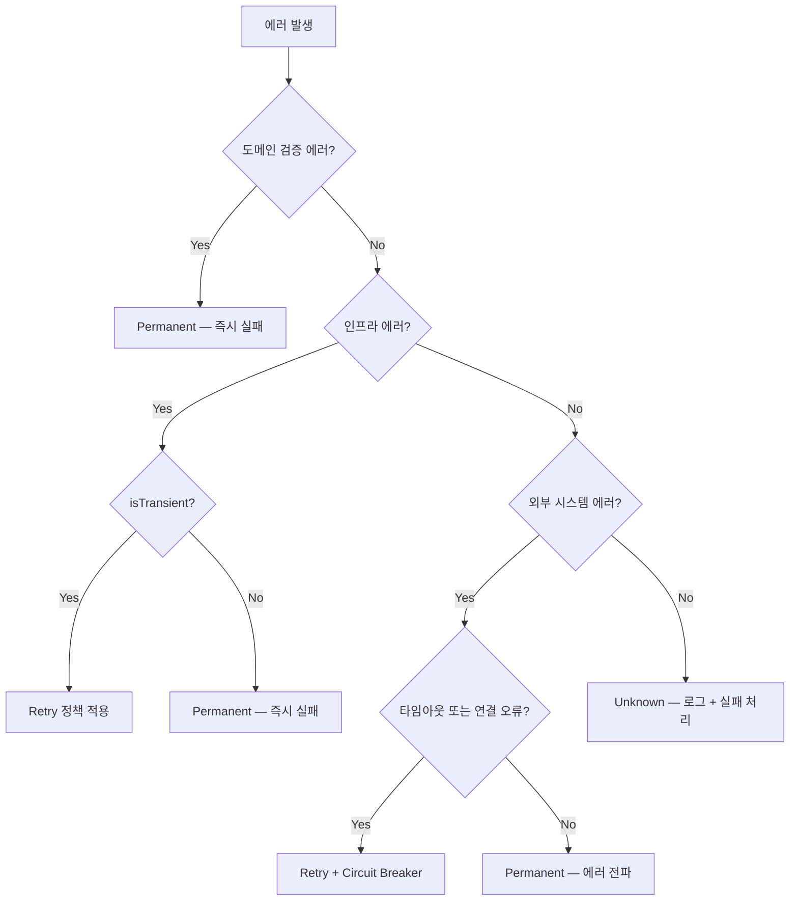

---

## 2. 재시도(Retry) 정책

### 2.1 외부 의존성별 Retry 전략

| 클라이언트 | 작업 | 재시도 횟수 | 백오프 전략 | Base Delay | Jitter | 비고 |
|-----------|------|-----------|-----------|------------|--------|------|
| **GitClient** | `clone` | 3회 | Exponential | 2s | ±500ms | 네트워크 의존. 대용량 리포지토리 고려 |
| | `createWorktree` | 2회 | Exponential | 1s | ±200ms | 파일시스템 잠금 가능성 |
| | `deleteWorktree` | 2회 | Exponential | 1s | ±200ms | 프로세스가 디렉토리 점유 가능 |
| | `commit` | 2회 | Exponential | 1s | ±200ms | 인덱스 잠금 가능성 |
| | `reset` | 2회 | Fixed | 1s | 없음 | 단순 로컬 작업 |
| | `createBranch` | 2회 | Fixed | 500ms | 없음 | |
| **AgentClient** | `start` | 3회 | Exponential | 3s | ±1s | 프로세스 스폰 실패 대비 |
| | `stop` | 2회 | Fixed | 1s | 없음 | 프로세스 종료 실패 시 force kill |
| | `sendQuery` | **0회** | — | — | — | **Idempotent하지 않음**. 중복 전송 위험 |
| **McpClient** | `validate` | 2회 | Exponential | 2s | ±500ms | 서버 시작 지연 가능 |
| | `listTools` | 2회 | Exponential | 1s | ±200ms | |
| **FileSystem** | `createDirectory` | 2회 | Fixed | 500ms | 없음 | 동시성 충돌 가능 |
| | `deleteDirectory` | 2회 | Fixed | 500ms | 없음 | 파일 점유 가능 |
| | `createSymlink` | 2회 | Fixed | 500ms | 없음 | |
| | `deleteSymlink` | 2회 | Fixed | 500ms | 없음 | |

### 2.2 Exponential Backoff 계산

```
delay = min(baseDelay * 2^attempt + random(-jitter, +jitter), maxDelay)
```

- `maxDelay`: 30초 (모든 작업 공통 상한)
- `attempt`: 0부터 시작

**예시: GitClient.clone (3회 재시도)**
```
시도 0 (최초): 즉시 실행
시도 1: 2s * 2^0 ± 500ms = 1.5s ~ 2.5s
시도 2: 2s * 2^1 ± 500ms = 3.5s ~ 4.5s
시도 3: 2s * 2^2 ± 500ms = 7.5s ~ 8.5s
```

### 2.3 Retry 불가 조건

다음 에러 타입은 `isTransient = false`이므로 재시도하지 않고 즉시 실패 처리한다:

- `GitAuthenticationError` — 인증 정보 문제
- `GitBranchNotFoundError` — 존재하지 않는 브랜치
- `McpServerNotFoundError` — MCP 서버 바이너리 없음
- `PermissionDeniedError` — 파일시스템 권한 부족
- 모든 `DomainValidationError` 하위 타입

### 2.4 sendQuery 재시도 불가 사유

`AgentClient.sendQuery`는 재시도하지 않는다. 이유:

1. **Idempotent하지 않음**: Agent가 이미 Query를 수신하고 처리를 시작했을 수 있음
2. **부분 실행 위험**: 동일 Query가 중복 전송되면 Agent가 작업을 두 번 수행
3. **상태 오염**: Agent의 컨텍스트에 동일 프롬프트가 중복 적재

대신 `AgentError` 이벤트를 통해 Workflow를 FAILED 상태로 전이시키고, 사용자가 Resume을 통해 재시도한다.

---

## 3. 타임아웃 정책

### 3.1 작업별 타임아웃

| 분류 | 작업 | 타임아웃 | 설정 가능 여부 | 비고 |
|------|------|---------|-------------|------|
| **Git** | `clone` | 5min | Yes | 리포지토리 크기에 따라 조정 |
| | `createWorktree` | 30s | No | 로컬 작업 |
| | `deleteWorktree` | 30s | No | 로컬 작업 |
| | `commit` | 30s | No | 로컬 작업 |
| | `reset` | 30s | No | 로컬 작업 |
| | `createBranch` | 10s | No | 로컬 작업 |
| **Agent** | `start` | 60s | Yes | 프로세스 스폰 + 초기화 |
| | `sendQuery` | 10min (default) | **Yes** | Task 복잡도에 따라 조정. WorkflowTemplate에서 Task별 설정 가능 |
| | `stop` | 30s | No | Graceful shutdown 후 force kill |
| **Report** | 생성 | 5min | Yes | Agent 응답 파싱 + 파일 생성 |
| **MCP** | `validate` | 30s | No | 서버 연결 + 핸드셰이크 |
| | `listTools` | 30s | No | 도구 목록 조회 |
| **Checkpoint** | `commit` (각 WorkTree) | 30s | No | Git commit 타임아웃과 동일 |
| **FileSystem** | 모든 작업 | 10s | No | 로컬 파일시스템 |

### 3.2 타임아웃 초과 시 처리

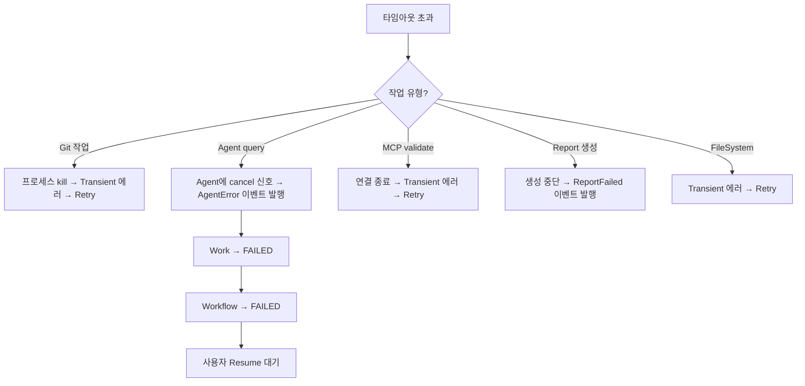

### 3.3 Agent Query 타임아웃 계층

Agent Query의 타임아웃은 다음 우선순위로 결정된다:

1. **Task-level 설정** (최우선): WorkflowTemplate의 TaskDefinition에 명시된 `queryTimeout`
2. **Work-level 설정**: Work에 명시된 기본 `queryTimeout`
3. **시스템 기본값**: 10분

---

## 4. Circuit Breaker

### 4.1 개요

Git 서버 또는 MCP 서버가 반복적으로 실패할 때, 불필요한 요청을 차단하여 시스템을 보호한다.

### 4.2 상태 전이

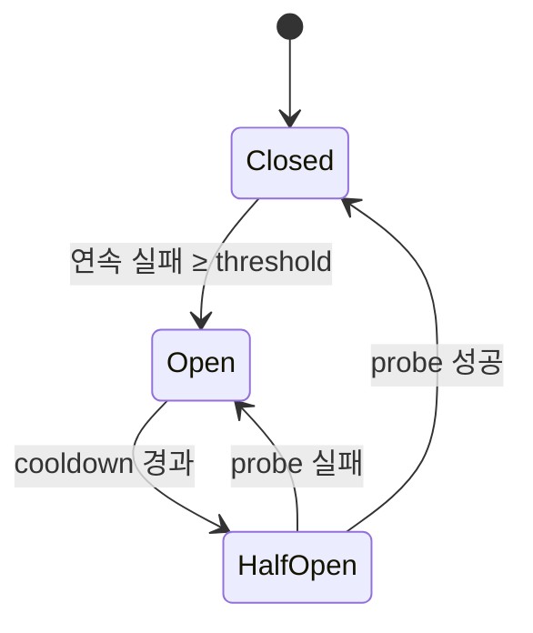

### 4.3 Circuit Breaker 설정

| 대상 | 실패 임계값 (threshold) | Cooldown | Probe 요청 수 | 적용 범위 |
|------|----------------------|----------|-------------|----------|
| **GitClient** (전체) | 연속 5회 실패 | 60초 | 1회 | 모든 Git 작업에 공유 |
| **McpClient** (서버별) | 연속 3회 실패 | 30초 | 1회 | MCP 서버 인스턴스별 독립 |

### 4.4 Circuit Breaker 동작 상세

**Closed 상태** (정상)
- 모든 요청을 통과시킨다
- 실패 카운터를 추적한다
- 연속 성공 시 실패 카운터를 리셋한다

**Open 상태** (차단)
- 모든 요청을 즉시 `CircuitBreakerOpenError`로 거부한다
- Cooldown 타이머 시작
- Cooldown 경과 후 Half-Open으로 전이

**Half-Open 상태** (탐색)
- 제한된 수의 Probe 요청만 통과시킨다
- Probe 성공 → Closed 전이, 실패 카운터 리셋
- Probe 실패 → Open 전이, Cooldown 재시작

### 4.5 Circuit Breaker와 Retry의 관계

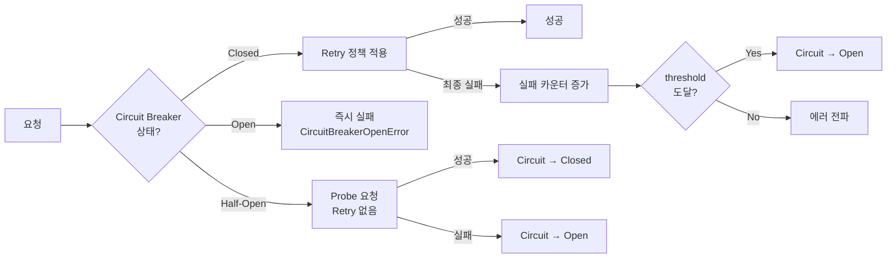

Retry는 Circuit Breaker 내부에서 동작한다. 즉, Circuit Breaker가 Open이면 Retry 자체가 시도되지 않는다.

---

## 5. 부분 실패 복구

### 5.1 prepareResources — WorkTree 일괄 생성

`StartWorkflowUseCase`에서 `WorkflowResourceService.prepareResources`를 호출하면 Workflow의 모든 GitRef에 대해 WorkTree를 생성한다. N개 중 일부가 실패할 수 있다.

**전략: All-or-Nothing**

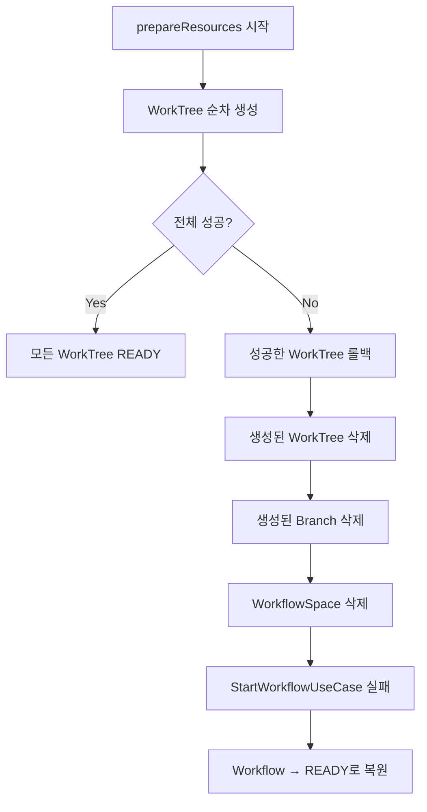

**All-or-Nothing 선택 근거**
- WorkTree는 Workflow 시작의 선행조건. 일부만 존재하면 Work 실행 중 누락된 리포지토리 접근 불가
- 부분 생성 상태는 사용자가 인지하기 어려운 불완전한 상태
- 실패 원인 해결 후 사용자가 다시 `StartWorkflow`를 호출하면 전체를 재생성

**롤백 실패 시 처리**

롤백 중 추가 실패가 발생하면:
1. 롤백 실패를 로그에 기록한다 (WARN 레벨)
2. `WorkflowSpace`의 `workTreeStatuses`에 각 WorkTree의 실제 상태를 반영한다
3. Workflow를 `FAILED` 상태로 전이시킨다
4. 사용자에게 수동 정리가 필요할 수 있음을 알린다

### 5.2 GitRef 추가 시 단건 WorkTree 생성 (READY/PAUSED/FAILED 상태)

`ModifyWorkflowUseCase.UpdateGitRefs`에서 GitRef 추가 시 WorkTree를 즉시 생성한다.

**전략: 개별 실패 허용**

- 단건 생성이므로 해당 GitRef의 `WorkTreeTrackingInfo`만 FAILED로 마킹
- Workflow 상태는 유지한다
- 사용자가 GitRef를 제거 후 재추가하여 재시도 가능

### 5.3 cleanupResources — WorkTree 일괄 삭제

`DeleteWorkflowUseCase`에서 리소스 정리 시 일부 WorkTree 삭제가 실패할 수 있다.

**전략: Best-Effort**

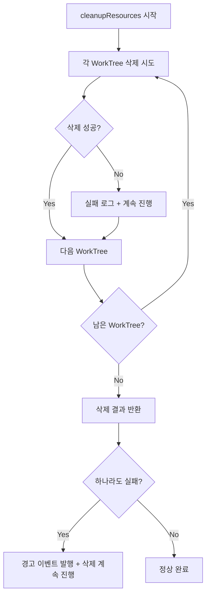

- 삭제 실패가 시스템 전체를 블로킹하지 않는다
- 실패한 리소스는 로그에 기록하고, 별도 정리 메커니즘(스케줄러 등)으로 후속 처리
- Workflow 삭제 자체는 진행한다

### 5.4 Resume 롤백 실패

`ResumeWorkflowUseCase`에서 `CheckpointService.rollback`은 각 WorkTree에 대해 `git reset`을 수행한다.

**전략: Fail-Fast**

- 하나의 WorkTree라도 rollback에 실패하면 Resume 전체를 중단한다
- 이미 rollback된 WorkTree들은 그대로 둔다 (일관성 깨짐 가능)
- Workflow를 FAILED 상태로 유지하고 에러 메시지에 실패 상세를 포함한다
- 사용자가 원인 해결 후 다시 Resume을 시도한다

---

## 6. 에러 전파 흐름

### 6.1 이벤트 체인 에러 전파 경로

```mermaid
graph TD
    subgraph "Agent Query 실패"
        AE1[Agent 프로세스] -->|AgentError| AEH[AgentErrorHandler]
        AEH --> WS1[work.agentStatus → ERROR]
        AEH --> WSC1[WorkStatusChanged 발행]
        AEH --> WFF1[WorkflowFailed 발행]
        WSC1 --> WSCH[WorkStatusChangedHandler]
        WSCH --> WFS1[workflow.workStatuses 업데이트]
        WFF1 --> UI1[UI 알림: Workflow FAILED]
    end

    subgraph "Query 실패"
        QF1[Agent 프로세스] -->|QueryFailed| QFH[QueryFailedHandler]
        QFH --> QS1[task.queryStatus → FAILED]
        QFH --> WSC2[WorkStatusChanged 발행]
        WSC2 --> WSCH2[WorkStatusChangedHandler]
        WSCH2 --> WFS2[workflow.workStatuses 업데이트]
    end

    subgraph "Report 생성 실패"
        RF1[Report 프로세스] -->|ReportFailed| RFH[ReportFailedHandler]
        RFH --> RS1[report.status → FAILED]
        RFH --> WSC3[WorkStatusChanged 발행]
        WSC3 --> WSCH3[WorkStatusChangedHandler]
        WSCH3 --> WFS3[workflow.workStatuses 업데이트]
    end

    subgraph "Checkpoint 생성 실패"
        CPF[CheckpointService] -->|commit 실패| CPEH[에러 로그]
        CPEH --> WFF2[WorkflowFailed 발행]
        WFF2 --> UI2[UI 알림: Workflow FAILED]
    end
```

### 6.2 UseCase 레벨 에러 전파

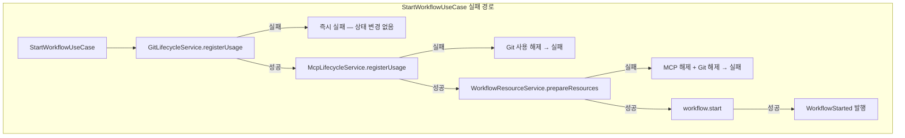

### 6.3 이벤트 핸들러 실패 처리

이벤트 핸들러 내부에서 에러가 발생하면:

| 핸들러 | 실패 시 동작 | 근거 |
|--------|------------|------|
| `WorkStartedHandler` | WorkflowFailed 전이 | Agent 시작 불가 → 진행 불가 |
| `WorkCompletedHandler` | Checkpoint 실패 로그 + WorkflowFailed 전이 | 체크포인트 없이 진행은 위험 |
| `QueryRespondedHandler` | Report 생성 실패 시 ReportFailed 발행 | Report 없이 Task 완료 불가 |
| `WorkflowTerminatedHandler` | Best-effort 정리 + 실패 로그 | 정리 실패가 종료를 막지 않음 |
| `WorkStatusChangedHandler` | 에러 로그 + 무시 | 상태 동기화 실패는 치명적이지 않음 |

---

## 7. Compensating Transaction

### 7.1 개요

복합 UseCase가 중간에 실패하면, 이미 수행된 단계를 역순으로 보상(compensate)해야 한다. 각 UseCase의 보상 트랜잭션은 가능한 한 **idempotent**하게 구현한다.

### 7.2 StartWorkflowUseCase — 보상 트랜잭션

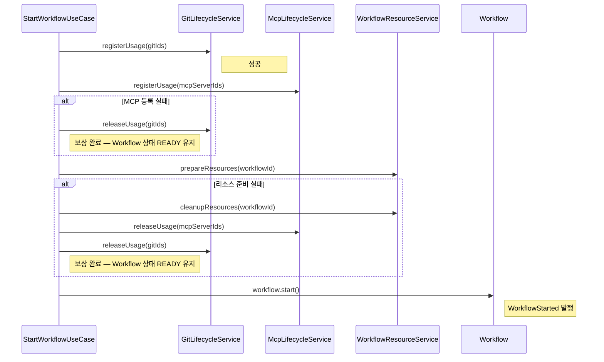

**보상 단계 요약**

| 실패 시점 | 보상 동작 (역순) | Workflow 최종 상태 |
|----------|----------------|------------------|
| `registerUsage(git)` 실패 | 없음 | READY |
| `registerUsage(mcp)` 실패 | Git 사용 해제 | READY |
| `prepareResources` 실패 | 리소스 정리 → MCP 해제 → Git 해제 | READY |
| `workflow.start()` 실패 | 리소스 정리 → MCP 해제 → Git 해제 | READY |

### 7.3 DeleteWorkflowUseCase — 보상 트랜잭션

DeleteWorkflow는 리소스 정리 후 데이터를 삭제하는 구조이므로, 보상보다는 **Best-Effort + 순서 보장**으로 접근한다.

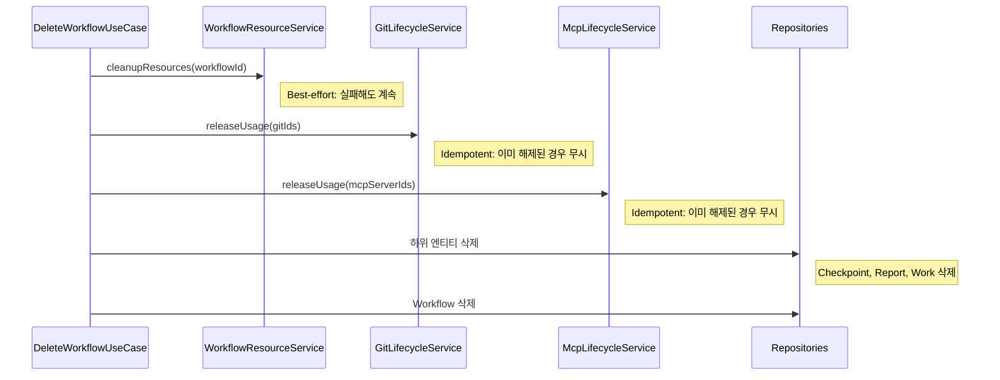

**실패 시 처리**

| 실패 시점 | 처리 | 근거 |
|----------|------|------|
| `cleanupResources` 실패 | 경고 로그 + 계속 진행 | 파일 정리 실패가 데이터 삭제를 막지 않음 |
| `releaseUsage` 실패 | 경고 로그 + 계속 진행 | Idempotent하므로 재시도 안전 |
| 하위 엔티티 삭제 실패 | 중단 + Workflow FAILED | 데이터 일관성 보호 |
| Workflow 삭제 실패 | 중단 + 에러 전파 | 재시도 필요 |

### 7.4 ResumeWorkflowUseCase — 보상 트랜잭션

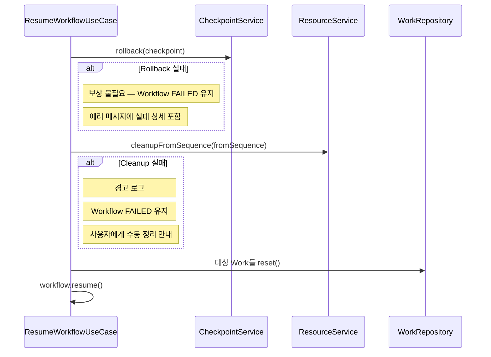

### 7.5 보상 트랜잭션 설계 원칙

1. **Idempotent 보상**: 보상 동작은 여러 번 실행해도 동일한 결과를 보장한다
   - `releaseUsage`는 이미 해제된 리소스에 대해 안전하게 무시
   - `cleanupResources`는 이미 삭제된 리소스를 스킵
2. **역순 실행**: 보상은 원래 작업의 역순으로 수행한다
3. **Best-Effort 정리**: 보상 중 실패가 발생해도 가능한 한 나머지 보상을 진행한다
4. **상태 복원**: 보상 완료 후 Aggregate의 상태를 실패 이전 상태로 복원한다
5. **로그 기록**: 모든 보상 동작과 결과를 상세히 로그에 기록한다

---

## 8. 종합 에러 처리 매트릭스

| 작업 | 에러 유형 | Retry | Timeout | Circuit Breaker | 실패 시 최종 동작 |
|------|----------|-------|---------|-----------------|-----------------|
| Git clone | Transient | 3회 | 5min | Yes (공유) | UseCase 실패 |
| Git worktree add | Transient | 2회 | 30s | Yes (공유) | 보상 트랜잭션 |
| Git commit (checkpoint) | Transient | 2회 | 30s | Yes (공유) | WorkflowFailed |
| Agent start | Transient | 3회 | 60s | No | WorkflowFailed |
| Agent sendQuery | — | **없음** | 10min* | No | AgentError → WorkflowFailed |
| Report 생성 | — | 없음 | 5min | No | ReportFailed → WorkStatusChanged |
| MCP validate | Transient | 2회 | 30s | Yes (서버별) | UseCase 실패 |
| Checkpoint commit | Transient | 2회 | 30s | Yes (공유) | WorkflowFailed |
| FileSystem 작업 | Transient | 2회 | 10s | No | 보상 트랜잭션 |

---

## 관련 문서
- [01-서비스-개요.md](01-서비스-개요.md) — 외부 의존성 정의 및 시스템 경계
- [03-유스케이스.md](03-유스케이스.md) — UseCase별 실행 단계 및 실패 지점
- [04-이벤트-흐름.md](04-이벤트-흐름.md) — 이벤트 체인에서의 에러 전파 경로
- [05-인프라스트럭처.md](05-인프라스트럭처.md) — Port 인터페이스 및 Adapter 구현
