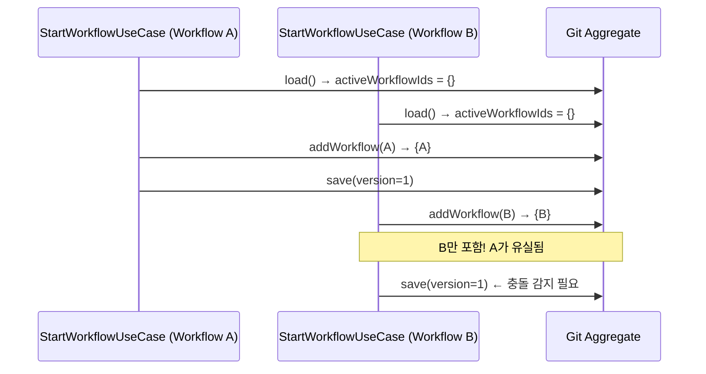
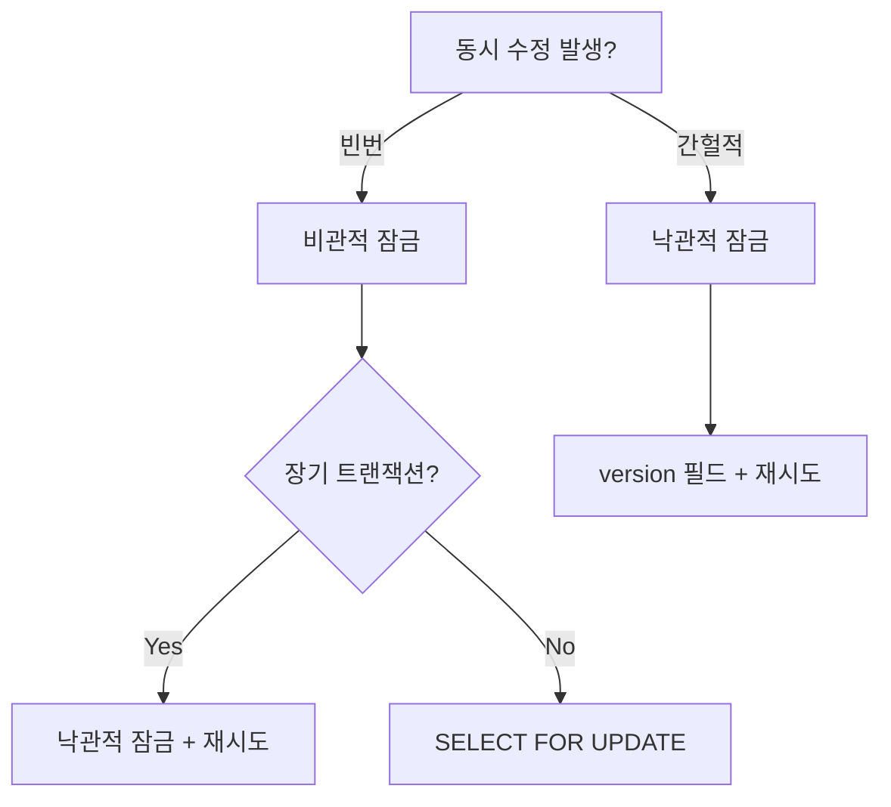
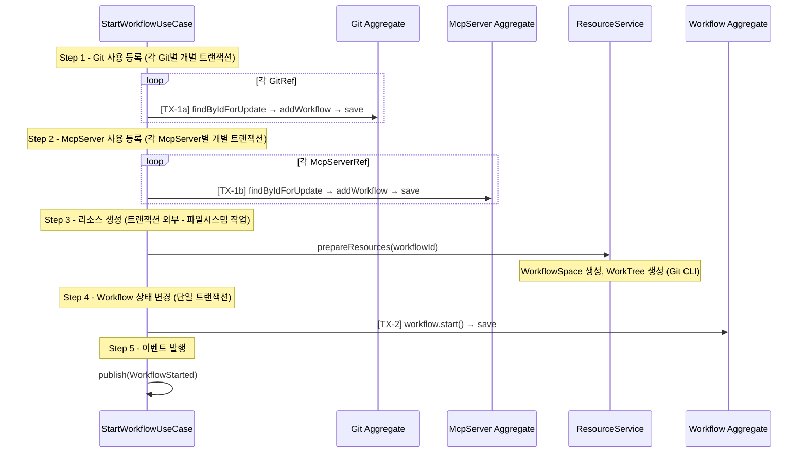
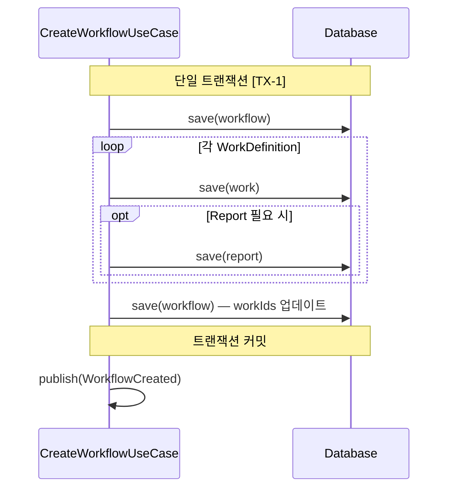
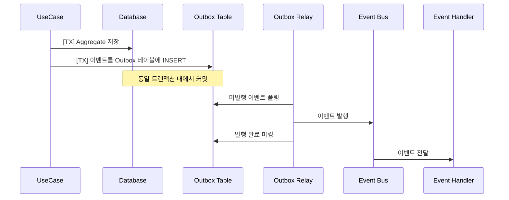
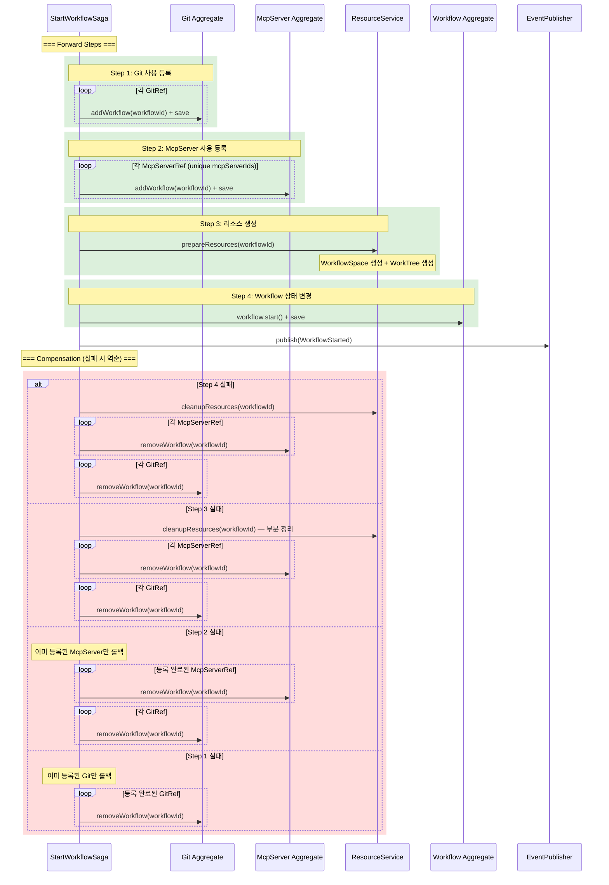
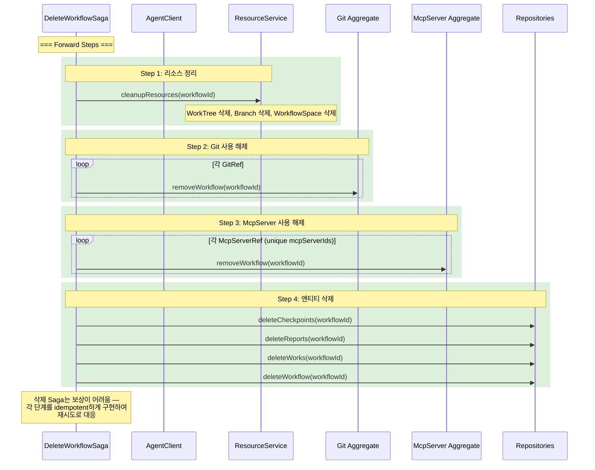
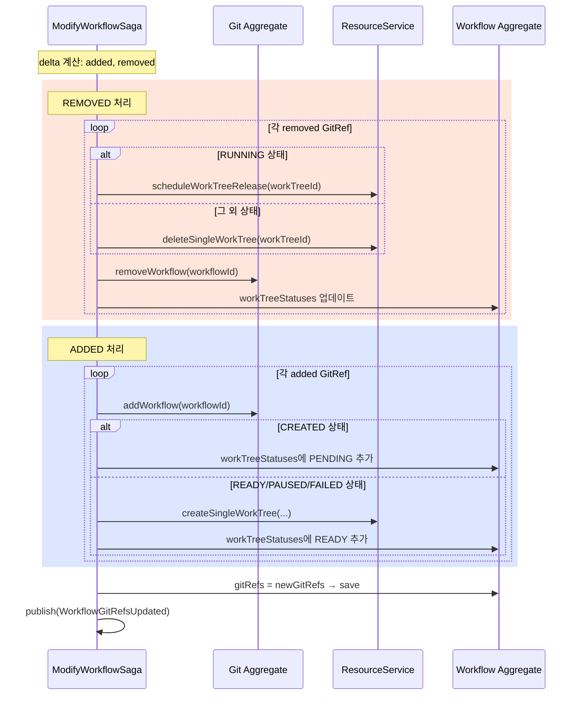

# 동시성 및 트랜잭션

## 1. Aggregate별 동시성 위험

### 1.1 위험 시나리오 총괄

| Aggregate | 시나리오 | 위험 | 심각도 |
|-----------|---------|------|--------|
| **Git** | 두 Workflow가 동시에 `addWorkflow()` 호출 | `activeWorkflowIds` Set에 하나만 등록되고 나머지 유실 (lost update) | 높음 |
| **Git** | `addWorkflow()`와 `deleteGit()` 동시 실행 | 사용 중인 Git이 삭제됨 (불변식 위반) | 높음 |
| **McpServer** | 두 Workflow가 동시에 `addWorkflow()` 호출 | Git과 동일한 lost update 패턴 | 높음 |
| **McpServer** | `addWorkflow()`와 `unregisterMcpServer()` 동시 실행 | 사용 중인 McpServer가 삭제됨 | 높음 |
| **Workflow** | `ModifyWorkflow`와 `ResumeWorkflow`가 PAUSED 상태에서 동시 실행 | 구조 변경과 실행 재개가 충돌하여 inconsistent 상태 | 높음 |
| **Workflow** | `PauseWorkflow`와 `WorkStatusChanged` 동시 처리 | `workStatuses` Map의 lost update | 중간 |
| **Workflow** | `WorkTreeStatusChanged` 이벤트 두 건 동시 도착 | `workTreeStatuses` Map의 lost update | 중간 |
| **Workflow** | `StartWorkflow`에서 Git 등록 후 Workflow 상태 변경 전 실패 | Git에는 등록되었으나 Workflow는 미시작 (불일치) | 높음 |
| **Work** | `AgentStarted`와 `PauseWorkflow`가 동시에 Work 수정 | `agentStatus` 불일치 | 중간 |
| **Work** | `CompleteTask`와 `AgentError` 동시 도착 | Task 완료 처리와 에러 처리 충돌 | 중간 |
| **WorkTree** | 동일 Git에 대해 두 Workflow가 동시에 worktree 생성 | Git CLI 레벨에서 lock 충돌 | 중간 |
| **Checkpoint** | `WorkCompleted` 핸들러에서 Checkpoint 생성과 다음 Work 시작 순서 역전 | Checkpoint 없이 다음 Work 시작 | 높음 |

### 1.2 공유 리소스 Aggregate의 경합 패턴

Git과 McpServer는 여러 Workflow가 공유하는 전역 리소스이다. `activeWorkflowIds` Set의 동시 수정이 핵심 위험이다.



---

## 2. 낙관적 잠금 (Optimistic Locking)

### 2.1 개요

각 Aggregate에 `version` 필드를 추가하여, 저장 시점에 version이 변경되었는지 확인한다. 변경되었다면 `OptimisticLockException`을 발생시키고, 호출자가 재시도한다.

```typescript
// Aggregate Base
abstract class AggregateRoot {
  readonly version: number;

  protected incrementVersion(): void {
    this.version++;
  }
}

// Repository 저장 시
interface Repository<T extends AggregateRoot> {
  save(aggregate: T): Promise<T>;
  // 내부 구현:
  // UPDATE ... SET version = version + 1 WHERE id = ? AND version = ?
  // affected rows == 0 → throw OptimisticLockException
}
```

### 2.2 적용 대상 및 전략

| Aggregate | version 필드 | 충돌 빈도 | 재시도 전략 |
|-----------|-------------|----------|-----------|
| **Git** | `version: number` | 높음 (다수 Workflow 공유) | 최대 3회 재시도 + exponential backoff |
| **McpServer** | `version: number` | 높음 (Git과 동일 패턴) | 최대 3회 재시도 + exponential backoff |
| **Workflow** | `version: number` | 중간 (이벤트 핸들러 경합) | 최대 3회 재시도 |
| **Work** | `version: number` | 중간 (Agent 이벤트 + UseCase 경합) | 최대 3회 재시도 |
| **WorkTree** | `version: number` | 낮음 | 재시도 없음 (실패 시 에러) |
| **WorkflowSpace** | `version: number` | 낮음 | 재시도 없음 |
| **Checkpoint** | 없음 | 없음 (append-only) | 해당 없음 |
| **Report** | `version: number` | 낮음 | 재시도 없음 |

### 2.3 재시도 구현

```typescript
async function withOptimisticRetry<T>(
  operation: () => Promise<T>,
  maxRetries: number = 3,
  baseDelay: number = 50
): Promise<T> {
  for (let attempt = 0; attempt <= maxRetries; attempt++) {
    try {
      return await operation();
    } catch (error) {
      if (error instanceof OptimisticLockException && attempt < maxRetries) {
        const delay = baseDelay * Math.pow(2, attempt);
        await sleep(delay);
        continue; // Aggregate를 다시 로드하고 재시도
      }
      throw error;
    }
  }
  throw new Error('Unreachable');
}
```

### 2.4 Workflow Aggregate의 세부 경합 지점

Workflow는 여러 이벤트 핸들러가 동시에 수정할 수 있는 가장 경합이 많은 Aggregate이다.

| 수정 주체 | 수정 필드 | 동시 발생 가능 상대 |
|----------|----------|------------------|
| `WorkStatusChangedHandler` | `workStatuses` | 다른 Work의 `WorkStatusChanged` |
| `WorkTreeStatusChangedHandler` | `workTreeStatuses` | 다른 Git의 `WorkTreeCreated` |
| `StartNextWorkUseCase` | `status` (RESUMING→RUNNING) | `ModifyWorkflowUseCase` |
| `PauseWorkflowUseCase` | `status`, `workStatuses` | `WorkStatusChangedHandler` |
| `CancelWorkflowUseCase` | `status`, `workStatuses` | `WorkStatusChangedHandler` |

이 모든 경우에 version 기반 낙관적 잠금으로 충돌을 감지하고, 재시도 시 최신 상태를 다시 로드한다.

---

## 3. 비관적 잠금 (Pessimistic Locking)

### 3.1 적용이 필요한 경우

낙관적 잠금만으로는 충분하지 않은 시나리오에서 비관적 잠금을 사용한다. 주로 **공유 리소스에 대한 빈번한 경합**이 예상되는 경우이다.

| 시나리오 | 잠금 대상 | 잠금 방식 | 이유 |
|---------|----------|----------|------|
| `StartWorkflowUseCase`에서 `Git.addWorkflow()` | Git row | `SELECT ... FOR UPDATE` | 다수 Workflow가 동시에 같은 Git을 참조하여 시작하면 높은 충돌률 |
| `StartWorkflowUseCase`에서 `McpServer.addWorkflow()` | McpServer row | `SELECT ... FOR UPDATE` | Git과 동일 패턴 |
| `DeleteGitUseCase`에서 삭제 가능 여부 확인 | Git row | `SELECT ... FOR UPDATE` | 확인 후 삭제 사이에 `addWorkflow` 끼어들기 방지 |
| `UnregisterMcpServerUseCase`에서 삭제 가능 여부 확인 | McpServer row | `SELECT ... FOR UPDATE` | 위와 동일 패턴 |

### 3.2 구현 예시: StartWorkflowUseCase의 Git 등록

```typescript
class StartWorkflowUseCase {
  async execute(workflowId: WorkflowId): Promise<void> {
    const workflow = await this.workflowRepo.findById(workflowId);

    // 비관적 잠금으로 Git 로드 및 수정
    for (const gitRef of workflow.gitRefs) {
      await this.transactionManager.execute(async (tx) => {
        const git = await this.gitRepo.findByIdForUpdate(gitRef.gitId, tx);
        git.addWorkflow(workflowId);
        await this.gitRepo.save(git, tx);
      });
    }

    // 이후 WorkTree 생성, Workflow 상태 변경 등
  }
}
```

### 3.3 비관적 잠금 vs 낙관적 잠금 선택 기준



| 기준 | 낙관적 잠금 | 비관적 잠금 |
|------|-----------|-----------|
| 충돌 빈도 | 낮음 ~ 중간 | 높음 |
| 트랜잭션 길이 | 길어도 무방 | 짧아야 함 |
| 적용 대상 | Workflow, Work 등 대부분 | Git, McpServer의 `addWorkflow` |
| 실패 모드 | 재시도 | 대기 (timeout 설정 필수) |

---

## 4. 트랜잭션 경계 정의

### 4.1 원칙

1. **하나의 트랜잭션은 하나의 Aggregate만 수정한다** (원칙)
2. 복수 Aggregate를 수정해야 하면 **Saga 패턴** 또는 **Eventual Consistency**를 사용한다
3. 이벤트 발행은 트랜잭션 커밋 후 수행한다 (Outbox Pattern 권장)

### 4.2 UseCase별 트랜잭션 범위

| UseCase | 수정 Aggregate | 트랜잭션 전략 | 비고 |
|---------|---------------|-------------|------|
| `CreateGitUseCase` | Git (1개) | 단일 트랜잭션 | GitClient.clone은 트랜잭션 외부 |
| `DeleteGitUseCase` | Git + WorkflowTemplate (N개) | Saga | Git 삭제 → 이벤트 → Template 캐스케이딩 |
| `RegisterMcpServerUseCase` | McpServer (1개) | 단일 트랜잭션 | |
| `UnregisterMcpServerUseCase` | McpServer + WorkflowTemplate (N개) | Saga | McpServer 삭제 → 이벤트 → Template 캐스케이딩 |
| `CreateWorkflowUseCase` | Workflow + Work (N개) + Report (N개) | 단일 트랜잭션 | 모두 새로 생성되므로 경합 없음 |
| `StartWorkflowUseCase` | Git (N개) + McpServer (N개) + WorkTree + WorkflowSpace + Workflow | **Saga** | 아래 상세 참조 |
| `PauseWorkflowUseCase` | Work (N개) + Workflow | Saga (순차) | 각 Work 정지 → Workflow 상태 변경 |
| `ResumeWorkflowUseCase` | Work (N개) + Workflow | Saga (순차) | Work reset → Workflow 상태 변경 |
| `CancelWorkflowUseCase` | Work (N개) + Workflow | Saga (순차) | 각 Work 취소 → Workflow 상태 변경 |
| `DeleteWorkflowUseCase` | 전체 관련 Aggregate | **Saga** | 아래 상세 참조 |
| `StartNextWorkUseCase` | Workflow + Work | 개별 트랜잭션 | Workflow 상태 확인 → Work 시작 |
| `CompleteTaskUseCase` | Work (1개) | 단일 트랜잭션 | 이벤트로 후속 처리 |
| `ModifyWorkflowUseCase` | Workflow + Work + Git + McpServer 등 | **Saga** | 변경 유형에 따라 다름 |
| `SendQueryUseCase` | Work (1개) | 단일 트랜잭션 | |

### 4.3 StartWorkflowUseCase 트랜잭션 상세

StartWorkflowUseCase는 여러 Aggregate를 수정하므로 각 단계별로 트랜잭션을 분리한다.



**실패 시 보상 처리**:
- Step 1 실패: 이미 등록된 Git의 `removeWorkflow` 보상
- Step 2 실패: Git 등록 롤백 + McpServer 등록 롤백
- Step 3 실패: 생성된 리소스 정리 + Git/McpServer 등록 롤백
- Step 4 실패: 리소스 정리 + Git/McpServer 등록 롤백

### 4.4 CreateWorkflowUseCase 트랜잭션 상세

CreateWorkflowUseCase는 모두 새로운 Aggregate를 생성하므로, 경합이 없어 단일 트랜잭션으로 처리할 수 있다.



---

## 5. 이벤트 순서 보장

### 5.1 동일 Aggregate 이벤트의 순서 보장

동일 Aggregate에서 발생한 이벤트는 발행 순서대로 소비되어야 한다. **Aggregate ID를 기준으로 파티셔닝**하여 순서를 보장한다.

```mermaid
graph LR
    subgraph "Event Producer"
        E1[WorkStatusChanged<br/>workflowId=WF1]
        E2[WorkflowPaused<br/>workflowId=WF1]
        E3[WorkStatusChanged<br/>workflowId=WF2]
    end

    subgraph "Partition Key: workflowId"
        P1[Partition WF1]
        P2[Partition WF2]
    end

    subgraph "Consumer"
        C1[Handler - WF1 전용]
        C2[Handler - WF2 전용]
    end

    E1 --> P1
    E2 --> P1
    E3 --> P2
    P1 --> C1
    P2 --> C2

    Note right of C1: E1 → E2 순서 보장
```

**파티셔닝 규칙**:

| 이벤트 카테고리 | Partition Key | 이유 |
|---------------|-------------|------|
| Workflow 이벤트 | `workflowId` | 동일 Workflow 상태 변경 순서 보장 |
| Work 이벤트 | `workflowId` | Work → Workflow 상태 전파 순서 보장 |
| Agent 이벤트 | `workId` | 동일 Work의 Agent 상태 순서 보장 |
| Task/Query 이벤트 | `workId` | 동일 Work의 Task 진행 순서 보장 |
| Resource 이벤트 | `workflowId` | WorkTree 상태 → Workflow 상태 전파 순서 보장 |
| Git/McpServer 이벤트 | `gitId` / `mcpServerId` | 등록/삭제 순서 보장 |

### 5.2 Outbox Pattern

DB 트랜잭션과 이벤트 발행의 원자성을 보장하기 위해 **Transactional Outbox Pattern**을 사용한다.



**Outbox 테이블 스키마**:

```sql
CREATE TABLE domain_event_outbox (
    id              BIGSERIAL PRIMARY KEY,
    aggregate_type  VARCHAR(100) NOT NULL,
    aggregate_id    VARCHAR(100) NOT NULL,      -- Partition Key
    event_type      VARCHAR(100) NOT NULL,
    payload         JSONB NOT NULL,
    created_at      TIMESTAMP NOT NULL DEFAULT NOW(),
    published_at    TIMESTAMP NULL,              -- NULL이면 미발행
    retry_count     INT NOT NULL DEFAULT 0
);

CREATE INDEX idx_outbox_unpublished
    ON domain_event_outbox (created_at)
    WHERE published_at IS NULL;
```

**Outbox Relay 구현 옵션**:

| 방식 | 특징 | 적합 |
|------|------|------|
| Polling | 주기적으로 미발행 이벤트 조회 | 단순 구현, 약간의 지연 허용 |
| CDC (Change Data Capture) | DB 로그 기반 실시간 감지 (Debezium 등) | 낮은 지연, 운영 복잡도 증가 |
| Transaction Log Tailing | WAL/Binlog 직접 파싱 | 최저 지연, 구현 복잡 |

본 시스템에서는 **Polling 방식** (100ms~500ms 주기)을 기본으로 권장한다. 이벤트 체인이 길지만 (최대 5~6단계), 각 단계에서 수백ms의 지연은 AI Agent 처리 시간 대비 무시 가능하다.

### 5.3 이벤트 중복 처리 (Idempotent Handler)

Outbox Relay의 at-least-once 특성상 동일 이벤트가 중복 전달될 수 있다. 모든 핸들러는 **멱등성(idempotency)**을 보장해야 한다.

**전략 1: 처리 완료 이벤트 기록**

```typescript
class IdempotentEventHandler {
  async handle(event: DomainEvent): Promise<void> {
    const alreadyProcessed = await this.processedEventRepo.exists(event.id);
    if (alreadyProcessed) return; // 중복 → 무시

    await this.doHandle(event);
    await this.processedEventRepo.save(event.id);
  }
}
```

**전략 2: 도메인 로직 자체의 멱등성**

| 핸들러 | 멱등성 확보 방법 |
|--------|---------------|
| `WorkStatusChangedHandler` | 이미 동일 status면 무시 (상태 비교) |
| `WorkCompletedHandler` | 이미 Checkpoint 존재하면 생성 스킵 |
| `WorkflowTerminatedHandler` | `removeWorkflow()`가 이미 idempotent (없으면 무시) |
| `AgentStartedHandler` | 이미 RUNNING이면 무시 |
| `WorkTreeStatusChangedHandler` | 이미 READY/FAILED이면 무시 |

**권장**: 핵심 핸들러에는 **두 전략을 모두 적용**한다. 도메인 로직 멱등성을 기본으로 하되, 처리 완료 기록으로 이중 안전장치를 둔다.

### 5.4 이벤트 체인의 순서 보장

본 시스템의 핵심 이벤트 체인에서 순서가 중요한 구간이다.

```
WorkCompleted → [1] Checkpoint 생성 → [2] StartNextWork
```

**문제**: `WorkCompletedHandler`가 Checkpoint 생성과 다음 Work 시작을 동시에 트리거하면, Checkpoint 없이 다음 Work가 시작될 수 있다.

**해결**: `WorkCompletedHandler`에서 동기적으로 순차 실행한다.

```typescript
class WorkCompletedHandler {
  async handle(event: WorkCompleted): Promise<void> {
    // Step 1: Checkpoint 생성 (동기)
    await this.checkpointService.createCheckpoint(
      event.workflowId, event.workId
    );

    // Step 2: 다음 Work 시작 (Checkpoint 생성 완료 후)
    await this.startNextWorkUseCase.execute(event.workflowId);
  }
}
```

**동일 이벤트에 대한 복수 핸들러 순서**:

| 이벤트 | 핸들러 | 실행 순서 | 이유 |
|--------|--------|----------|------|
| `WorkCompleted` | CheckpointService → StartNextWorkUseCase | 순차 (동기) | Checkpoint가 먼저 있어야 Resume 가능 |
| `WorkflowCancelled` | WorkflowTerminatedHandler (리소스 해제) | 단일 핸들러 | 순서 무관 |
| `AgentError` | AgentErrorHandler (Work + Workflow 상태 변경) | 단일 핸들러 | 순서 무관 |
| `QueryResponded` | QueryRespondedHandler (Report 또는 Task 완료) | 단일 핸들러 | 분기 처리 |

---

## 6. Saga 패턴

### 6.1 StartWorkflowSaga



**Saga 상태 머신**:

```typescript
enum StartWorkflowSagaState {
  GIT_REGISTERING,
  MCP_REGISTERING,
  RESOURCES_PREPARING,
  WORKFLOW_STARTING,
  COMPLETED,
  COMPENSATING,
  FAILED
}
```

### 6.2 DeleteWorkflowSaga



**DeleteWorkflow 특이사항**:
- 삭제는 보상 트랜잭션을 정의하기 어렵다 (삭제된 리소스를 복원하기 어려움)
- 대신 각 단계를 **idempotent**하게 구현하여, 실패 시 전체 Saga를 처음부터 재시도한다
- `removeWorkflow()`는 이미 해제된 경우 무시하므로 안전하게 재시도 가능

### 6.3 ModifyWorkflowSaga (UpdateGitRefs)

GitRef 변경은 여러 Aggregate를 수정하는 복합 작업이다.



---

## 7. 데드락 방지

### 7.1 Aggregate 접근 순서 규칙

복수 Aggregate를 비관적 잠금으로 접근할 때, **항상 동일한 순서로 잠금을 획득**하여 데드락을 방지한다.

**전역 잠금 순서 (Lock Ordering)**:

```
1. Git          (가장 먼저)
2. McpServer
3. WorkTree
4. WorkflowSpace
5. Workflow
6. Work
7. Report
8. Checkpoint   (가장 나중)
```

**규칙**:
- 동일 타입의 Aggregate를 여러 개 잠글 때는 **ID의 사전순(lexicographic order)**으로 잠근다
- 이 순서를 모든 UseCase와 Saga에서 일관되게 적용한다

### 7.2 적용 예시

```typescript
// StartWorkflowUseCase: Git → McpServer → Workflow 순서
class StartWorkflowUseCase {
  async execute(workflowId: WorkflowId): Promise<void> {
    const workflow = await this.workflowRepo.findById(workflowId);

    // 1. Git 잠금 (ID 사전순)
    const sortedGitIds = workflow.gitRefs
      .map(ref => ref.gitId)
      .sort();
    for (const gitId of sortedGitIds) {
      await this.lockAndRegisterGit(gitId, workflowId);
    }

    // 2. McpServer 잠금 (ID 사전순)
    const sortedMcpServerIds = this.collectUniqueMcpServerIds(workflow)
      .sort();
    for (const mcpServerId of sortedMcpServerIds) {
      await this.lockAndRegisterMcpServer(mcpServerId, workflowId);
    }

    // 3. Workflow 상태 변경
    // ...
  }
}
```

### 7.3 데드락이 발생할 수 있는 시나리오와 방지

| 시나리오 | 위험 | 방지 전략 |
|---------|------|----------|
| Workflow A가 Git1 → Git2 순으로 잠금, Workflow B가 Git2 → Git1 순으로 잠금 | 순환 대기 | ID 사전순으로 통일 |
| `StartWorkflow`가 Git 잠금 → `DeleteGit`이 같은 Git 잠금 | 일반적인 경합 | 동일 리소스이므로 순차 처리됨 (데드락 아님) |
| `ModifyWorkflow`가 Git + Workflow 잠금, 이벤트 핸들러가 Workflow 잠금 | 잠금 순서 불일치 가능 | 이벤트 핸들러는 낙관적 잠금만 사용 |
| Saga Step 중간에 다른 Saga가 같은 Aggregate 잠금 | 장시간 대기 | 잠금 timeout 설정 (5초) + 재시도 |

### 7.4 잠금 Timeout 정책

```typescript
const LOCK_TIMEOUT_MS = 5000; // 5초

// 비관적 잠금 타임아웃 설정
SET lock_timeout = '5s'; -- PostgreSQL
SET innodb_lock_wait_timeout = 5; -- MySQL
```

- Timeout 발생 시 `LockTimeoutException`을 throw
- UseCase 레벨에서 catch하여 보상 트랜잭션 실행 후 재시도 또는 에러 반환

---

## 8. 동시성 제어 종합 정리

### 8.1 Aggregate별 잠금 전략 요약

| Aggregate | 낙관적 잠금 | 비관적 잠금 | Outbox | 비고 |
|-----------|-----------|-----------|--------|------|
| Git | O (version) | O (addWorkflow, delete) | O | 공유 리소스 |
| McpServer | O (version) | O (addWorkflow, delete) | O | 공유 리소스 |
| WorkflowTemplate | O (version) | X | O | 독립적, 경합 낮음 |
| Workflow | O (version) | X | O | 이벤트 핸들러 경합 → 재시도 |
| Work | O (version) | X | O | Agent 이벤트 경합 → 재시도 |
| WorkTree | O (version) | X | O | |
| WorkflowSpace | O (version) | X | O | |
| Report | O (version) | X | O | |
| Checkpoint | X | X | O | Append-only |

### 8.2 동시성 시나리오별 해결 전략 요약

| 시나리오 | 해결 전략 |
|---------|----------|
| 동일 Git에 여러 Workflow 동시 시작 | 비관적 잠금 (`SELECT FOR UPDATE`) |
| ModifyWorkflow + ResumeWorkflow 동시 실행 | 낙관적 잠금 (version 충돌 → 한쪽 재시도) |
| WorkCompleted → Checkpoint → StartNextWork 순서 | 동기적 순차 실행 (핸들러 내부) |
| 동일 이벤트 중복 전달 | Idempotent handler + 처리 기록 |
| DB 저장 + 이벤트 발행 원자성 | Outbox Pattern |
| 복수 Aggregate 수정 | Saga Pattern + 보상 트랜잭션 |
| 데드락 | 전역 잠금 순서 + ID 사전순 + timeout |

---

## 관련 문서
- [01-서비스-개요.md](01-서비스-개요.md) — 시스템 전체 개요
- [02-도메인-모델.md](02-도메인-모델.md) — Aggregate 상세 및 불변식
- [03-유스케이스.md](03-유스케이스.md) — UseCase별 실행 단계
- [04-이벤트-흐름.md](04-이벤트-흐름.md) — 이벤트 발행/소비 흐름
- [05-인프라스트럭처.md](05-인프라스트럭처.md) — Repository, EventPublisher 구현
